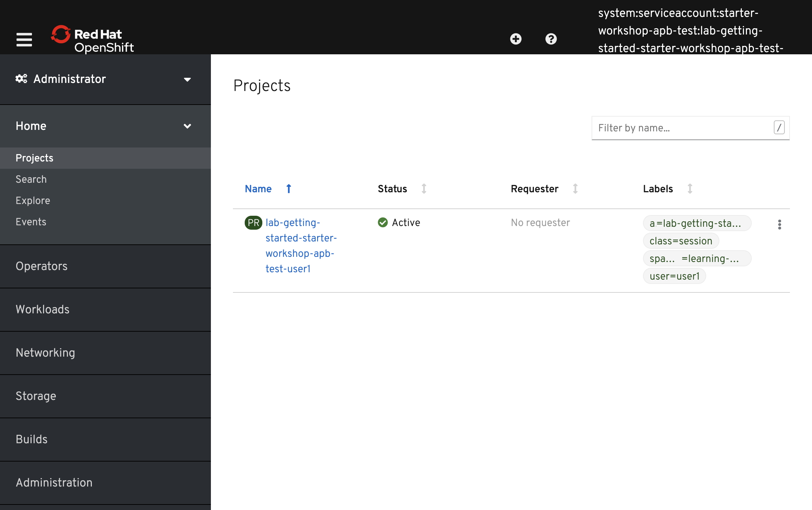
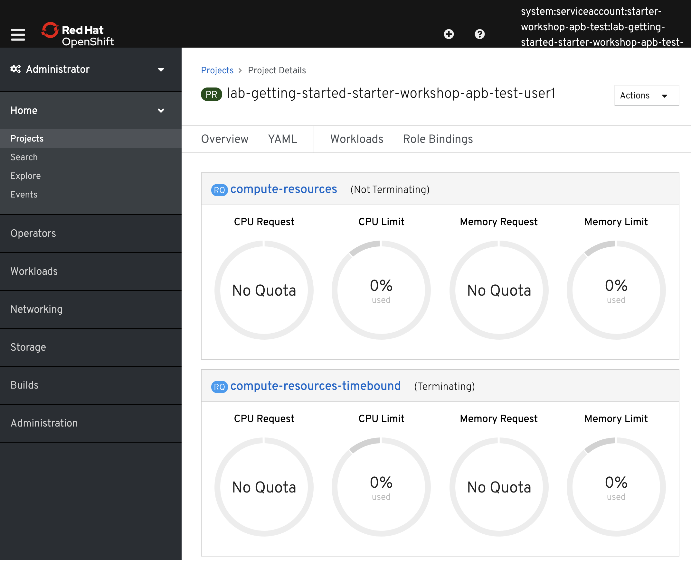
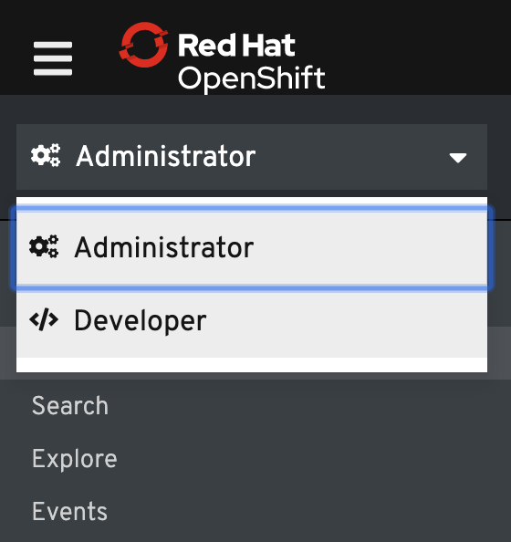
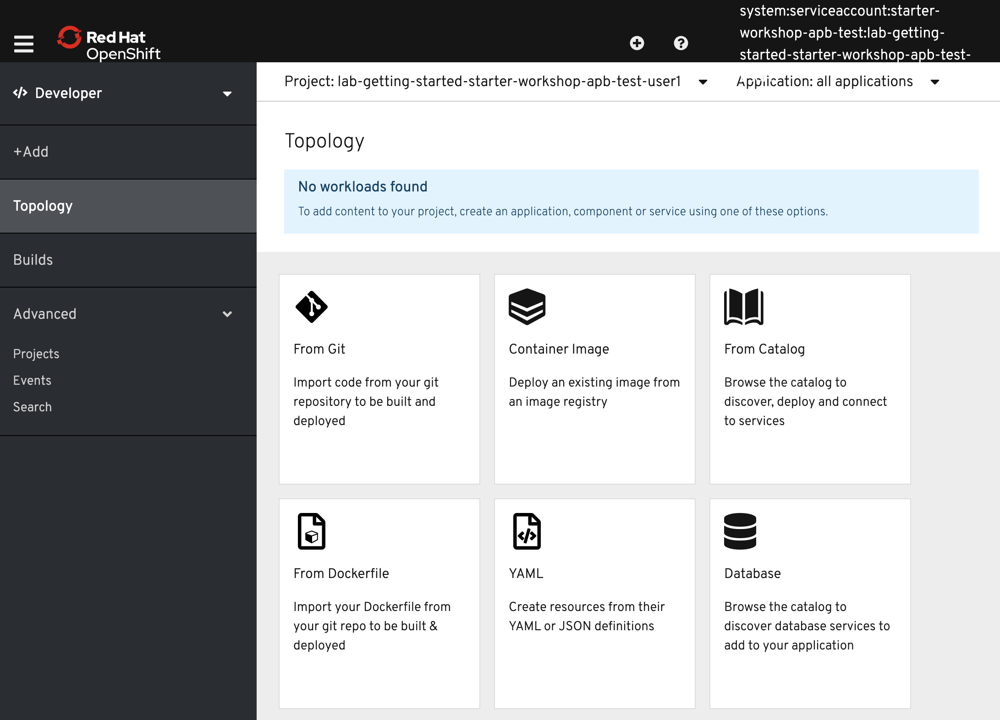

== Command Line Interface

OpenShift includes a feature-rich web console with both an Administrator perspective and a Developer perspective. In addition to the web console, OpenShift includes command line tools
to provide users with a nice interface to work with applications deployed to the
platform.  The `oc` command line tool is an executable written in the Go
programming language and is available for the following operating systems:

- Microsoft Windows
- macOS 10
- Linux

This lab environment has the `oc` command line tool installed, and your lab user is already logged in to the OpenShift cluster.

Issue the following command to see help information:

[source,bash,role=execute-1]
----
oc help
----

== Using a Project

Projects are a top level concept to help you organize your deployments. An
OpenShift project allows a community of users (or a user) to organize and manage
their content in isolation from other communities. Each project has its own
resources, policies (who can or cannot perform actions), and constraints (quotas
and limits on resources, etc). Projects act as a "wrapper" around all the
application services and endpoints you (or your teams) are using for your work.

During this lab, we are going to use a few different commands to make sure that
things in the environment are working as expected.  Don't worry if you don't
understand all of the terminology as we will cover it in detail in later labs.

In this lab environment, you already have access to single project: *{{ project_namespace  }}*.

If you had multiple projects, the first thing you would want to do is to switch
to the *{{ project_namespace  }}* project to make sure you're on the correct project from now on.
You can do this with the following command:

[source,bash,role=execute-1]
----
oc project {{ project_namespace  }}
----

You will see the following confirmation message:

[source,bash]
----
Now using project "{{ project_namespace  }}" on server "{{API_ADDRESS}}".
----

== The Web Console

OpenShift ships with a web-based console that will allow users to
perform various tasks via a browser. In the Homeroom environment, the web console is embedded within the dashboard you are using to access the workshop.

To get a feel for how the web console works, switch to the web console by clicking on the **Console** tab or click here on this link:{{console_url}}[Web Console] ++++++ link.

The first time you access the web console, you will most likely be in the Administrator perspective. You will be presented with the list of Projects that you can access, and you will see something that looks like the following image:

Click on the *{{ project_namespace  }}* project link. When you click on the
*{{ project_namespace  }}* project, you will be taken to the project details page,
which will list some metrics and details about your project. There's nothing there now, but that will change as you progress through the lab.

At the top of the left navigation menu, you can toggle between the Administrator perspective and the Developer perspective.

Select *Developer* to switch to the Developer perspective. Once the Developer perspective loads, you should be in the *Topology* view. Right now, there are no applications or components to view, but once you begin working on the lab, you'll be able to visualize and interact with the components in your application here.

We will be using a mix of command line tooling and the web console for the labs.
Get ready!
