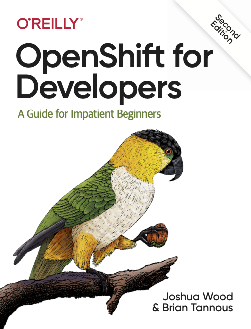
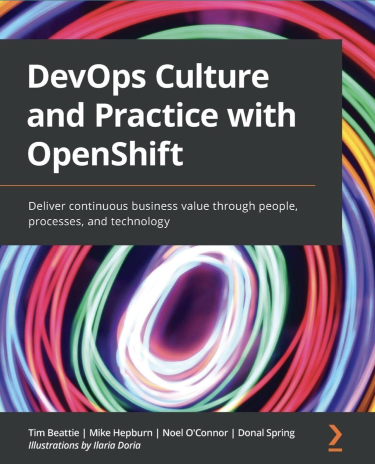
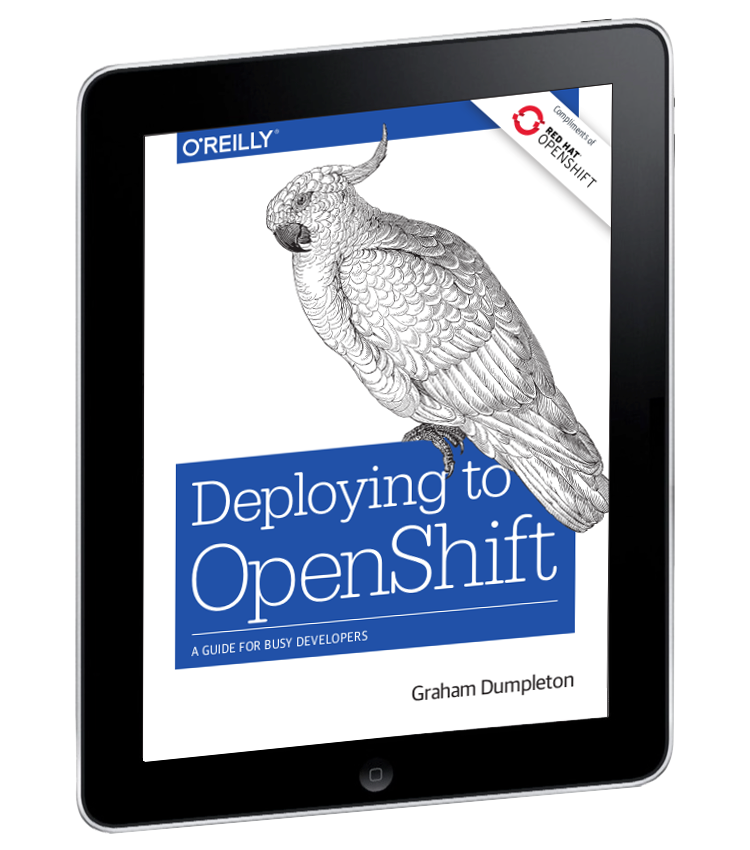

The exercices in this workshop have shown you how OpenShift can be used not only for deploying
stateless web applications, but also applications which require persistent
file system storage.

This flexibility makes OpenShift an ideal platform for deploying both web
applications and databases.

If you have finished this workshop early and want to experiment some more,
we have additional exercises you can try out using our online interactive
learning environment.

* *link:https://learn.openshift.com/[OpenShift Interactive Learning
Portal]* - An online interactive learning environment where you can run
through various scenarios related to using OpenShift.

The online interactive learning environment is always available so you
can continue to work on those exercises even after the workshop is over.

Below you will find further resources for learning about OpenShift and
running OpenShift on your own computer, as well as details about OpenShift
Online or other OpenShift related products and services.

* *link:https://docs.openshift.com[OpenShift Documentation]* - The landing page for OpenShift documentation.

* *link:https://developers.redhat.com/openshift/[OpenShift Resources on developers.redhat.com]* - A collection of resources for developers who are building and deploying applications on OpenShift.

* *link:https://developers.redhat.com/products/codeready-containers/overview[CodeReady Containers]* - A tool which can
be used to install a local OpenShift cluster on your own computer, running
in a virtual machine.

* *link:https://www.openshift.com/try[Try OpenShift Container Platform]* - Try Red
Hat supported OpenShift on Developer Sandbox, Managed and Self-Managed offering.

* *link:https://commons.openshift.org[OpenShift Commons]* - A community for users, partners, customers, and contributors to come together to collaborate and work together on OpenShift.

Free link:https://developers.redhat.com/e-books[online eBooks are also available for download]

Including the following e-books related to OpenShift.

* *link:https://developers.redhat.com/e-books/openshift-for-developers[OpenShift
for Developers]*

* *link:https://www.openshift.com/devops-with-openshift/[DevOps with OpenShift]*

* *link:https://developers.redhat.com/e-books/deploying-openshift-old[Deploying with OpenShift]*

