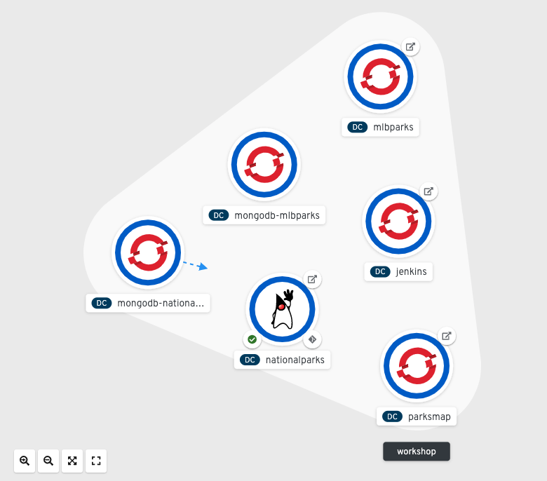
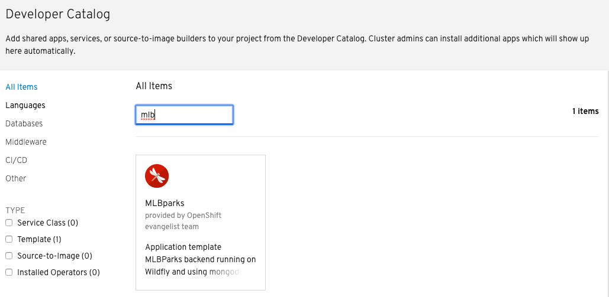
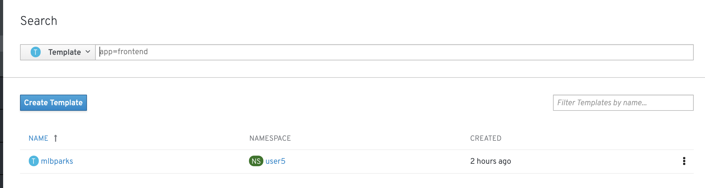
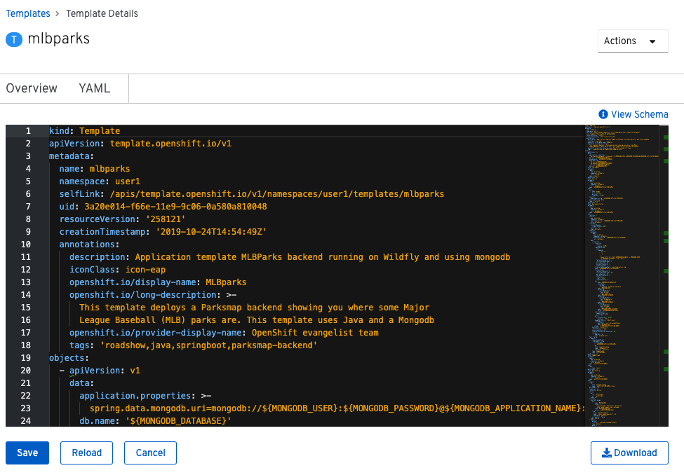

In this lab, we're going to deploy a complete backend application, consisting of
a REST API backend and a MongoDB database. The complete application will already
be wired together and described as a backend for the map visualization tool, so
that once the application is built and deployed, you will be able to see the new
map.

image::images/roadshow-app-architecture-mlbparks.png[Application architecture,800,align="center"]

== Background: Templates
Running all these individual commands can be tedious and error prone.
Fortunately for you, all of this configuration can be put together into a single
*Template* which can then be processed to create a full set of resources. As you
saw with MongoDB, a *Template* may define parameters for certain values, such as
DB username or password, and they can be automatically generated by OpenShift at
processing time.

Administrators can load *Templates* into OpenShift and make them available to
all users. Users can create *Templates* and load them
into their own *Projects* for other users (with access) to share and use.

The great thing about *Templates* is that they can speed up the deployment
workflow for application development by providing a "recipe" of sorts that can
be deployed with a single command.  Not only that, they can be loaded into
OpenShift from an external URL, which will allow you to keep your templates in a
version control system. 

Let's combine all of the exercises we have performed in the last several labs by
using a *Template* that we can instantiate with a single command.  While we
could have used templates to deploy everything in the workshop today, remember
that it is important for you to understand how to create, deploy, and wire
resources together.

== Exercise: Instantiate a Template

The front end application we've been working with this whole time will display
as many back end services' data as are created. Adding more stuff with the right
*Label* will make more stuff show up on the map.

Now you will deploy a map of Major League Baseball stadiums in the US by using a
template. It is pre-configured to build the back end Java application, and
deploy the MongoDB database. It also uses a *Hook* to call the `/ws/data/load`
endpoint to cause the data to be loaded into the database from a JSON file in
the source code repository. Execute the following command:

[source,bash,role=execute-1]
----
oc create -f https://raw.githubusercontent.com/openshift-roadshow/mlbparks/master/ose3/application-template-eap.json
----

What just happened? What did you just `create`? The item that we passed to the `create`
command is a *Template*. `create` simply makes the template available in
your *Project*. You can see this with the following command:

[source,bash,role=execute-1]
----
oc get template
----

You will see output like the following:

[source,bash]
----
mlbparks      Application template MLBParks backend running on Wildfly and using mongodb   12 (2 blank)   8
----

Run the following command to instantiate the template:

[source,bash,role=execute-1]
----
oc new-app mlbparks -p APPLICATION_NAME=mlbparks
----

[TIP]
====
The template can also use maven for the build. In case you want to try this option
provide the *MAVEN_MIRROR_URL* parameter with the location of the internal nexus
repository:

[source,bash,role=copypaste]
----
oc new-app mlbparks --name=mlbparks -p MAVEN_MIRROR_URL=http://nexus.{{INFRA_PROJECT}}.svc.cluster.local:8081/repository/maven-all-public
----
====

You will see some output similar to this:

[source,bash]
----
--> Deploying template "user1/mlbparks" to project user1

     MLBparks
     ---------
     Application template MLBParks backend running on Wildfly and using mongodb

     * With parameters:
        * Application Name=mlbparks
        * Application route=
        * Mongodb App=mongodb-mlbparks
        * Git source repository=https://github.com/openshift-roadshow/mlbparks.git
        * Git branch/tag reference=master
        * Maven mirror url=
        * Database name=mongodb
        * Database user name=userW3n # generated
        * Database user password=4PmSfXWL # generated
        * Database admin password=cBQ4RGJf # generated
        * GitHub Trigger=TOR1p3wO # generated
        * Generic Trigger=NUlqyK54 # generated

--> Creating resources ...
    configmap "mlbparks" created
    service "mongodb-mlbparks" created
    deploymentconfig.apps.openshift.io "mongodb-mlbparks" created
    imagestream.image.openshift.io "mlbparks" created
    buildconfig.build.openshift.io "mlbparks" created
    deploymentconfig.apps.openshift.io "mlbparks" created
    service "mlbparks" created
    route.route.openshift.io "mlbparks" created
--> Success
    Build scheduled, use 'oc logs -f bc/mlbparks' to track its progress.
    Access your application via route 'mlbparks-user5.apps.cluster-1d43.1d43.openshiftworkshop.com'
    Run 'oc status' to view your app.
----

OpenShift will now:

* Configure and start a build
** Using the supplied Maven mirror URL (if you have specified the parameter)
** From the supplied source code repository
* Configure and deploy MongoDB
** Using auto-generated user, password, and database name
* Configure environment variables for the app to connect to the DB
* Create the correct services
* Label the app service with `type=parksmap-backend`

All with one command!

When the build is complete, visit the parks map. Does it work? Think about how
this could be used in your environment.  For example, a template could define a
large set of resources that make up a "reference application", complete with
several app servers, databases, and more.  You could deploy the entire set of
resources with one command, and then hack on them to develop new features,
microservices, fix bugs, and more.

In Topology view, you can drag `mlbparks` and `mongodb-mlbparks` into the `workshop` application grouping.

In addition to being able to instantiate templates from the command line as we did above, templates can also be instantiated from the Developer Perspective in the web console. Click *+Add*, then *From Catalog* and search for `mlb`. You should see a result for `MLBparks`.

If you click on `MLBparks` and then click the *Instantiate Template* button, you'll see a form that guides you through the different required and optional parameters needed to instantiate this template.

CAUTION: Do not actually instantiate the template from the web console now, since you have already done so via the command line.

As a final exercise, look at the template that was used to create the
resources for our *mlbparks* application.

[source,bash,role=execute-1]
----
oc get template mlbparks -o yaml
----

But as always, you can use the OpenShift web console to do the same. In the Developer Perspective, click *Advanced -> Search* in the left navigation, then select *Template* from the dropdown, and click *mlbparks*. 

On the next page, click *YAML* to see/edit the YAML from here.

