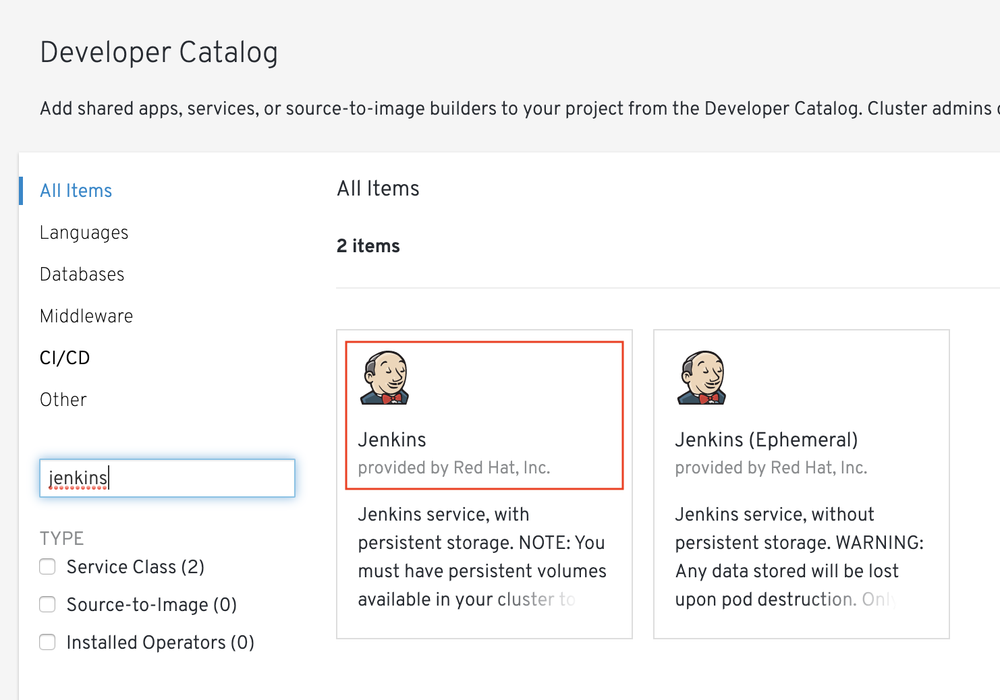
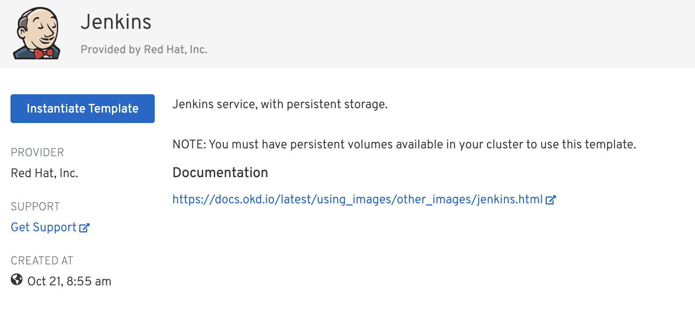
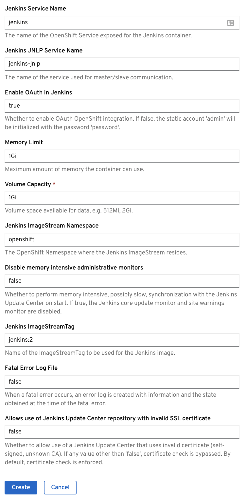
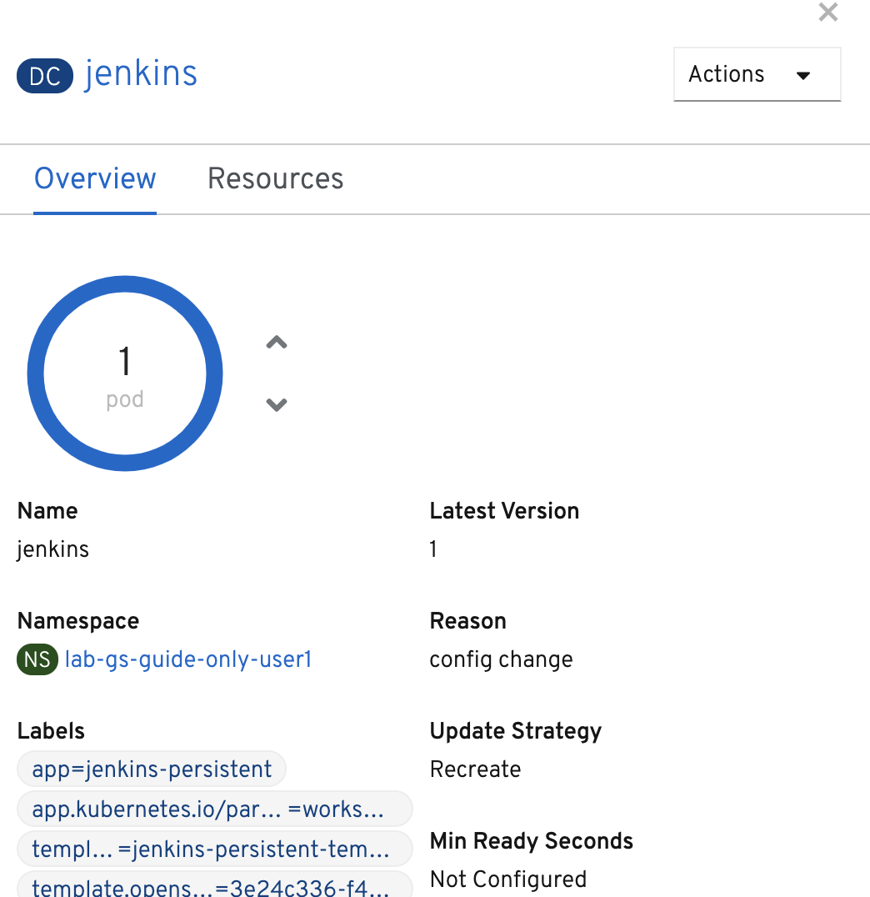
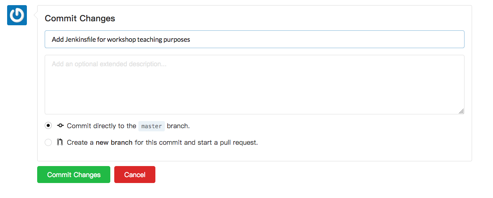
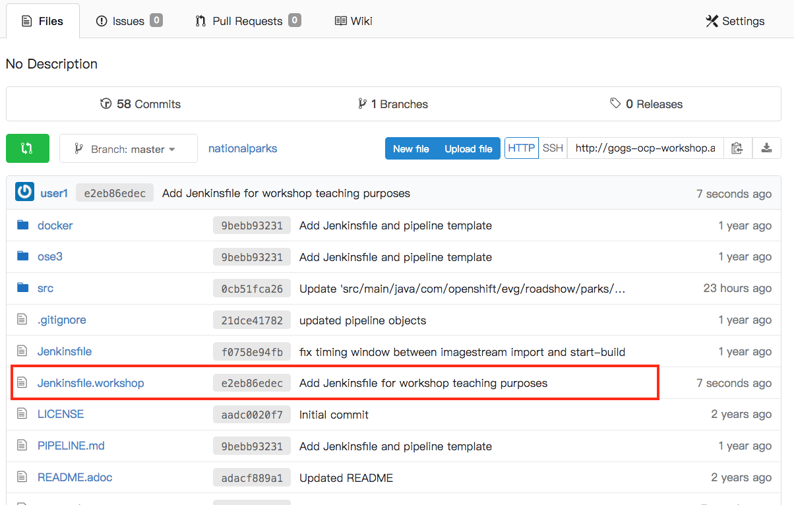
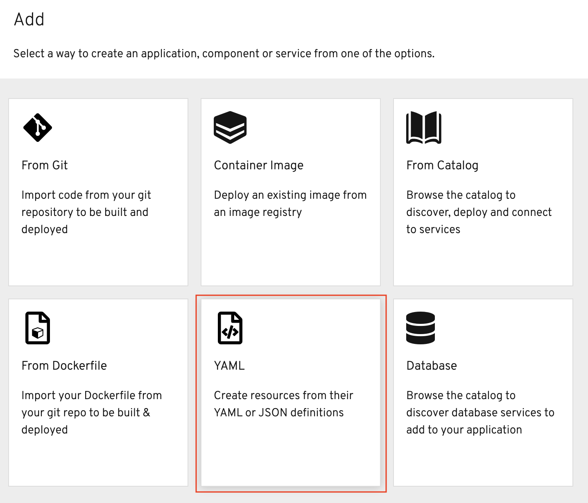
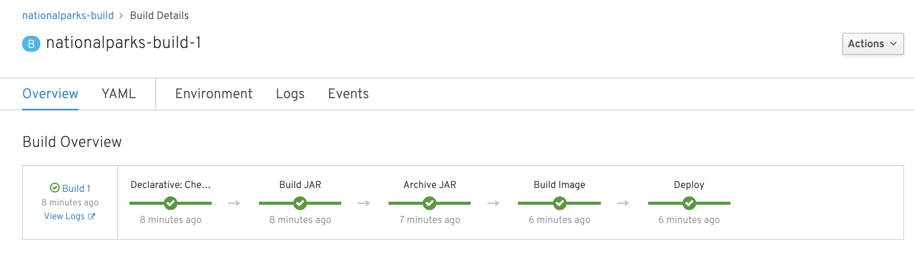

In this lab you will learn about pipelines and how to configure a pipeline in OpenShift so
that it will take care of the application lifecycle.

== Background: Continuous Integration and Pipelines

A continuous delivery (CD) pipeline is an automated expression of your process for getting software
from version control right through to your users and customers.
Every change to your software (committed in source control) goes through a complex process on
its way to being released. This process involves building the software in a reliable and repeatable
manner, as well as progressing the built software (called a "build") through multiple stages of
testing and deployment.

Pipeline provides an extensible set of tools for modeling simple-to-complex delivery pipelines
"as code" via the link:https://jenkins.io/doc/book/pipeline/syntax[Pipeline domain-specific language (DSL)]
syntax. OpenShift provides also an link:https://github.com/openshift/jenkins-client-plugin[OpenShift Jenkins Pipeline DSL]
for interacting with the platform from within a Jenkins pipeline in a fluent manner.

The definition of a Jenkins Pipeline is written into a text file (called a Jenkinsfile) which
in turn can be committed to a project’s source control repository. This is the foundation of
"Pipeline-as-code"; treating the CD pipeline a part of the application to be versioned
and reviewed like any other code.

image::images/devops-pipeline-flow.png[Pipelines]

== Set Up Your Pipeline

A deployment configuration in OpenShift can contain 
https://{{DOCS_URL}}/dev_guide/deployments/basic_deployment_operations.html#triggers[triggers], which tells OpenShift to automatically redeploy the pod whenever a new image is built for that service or configuration changes.

As we want the Jenkins pipeline to control when builds and deployments happen, we need to disable the ability
on the current Deployment to automatically trigger when there is a new image or a configuration change.

== Configure Manual Deployments on Dev Application

In the {{project_namespace}} project, click on the `nationalparks` component from Topology view. From the side panel, click on *Actions -> Edit Deployment Config*:

image::images/devops-pipeline-deployment-edit.png[Edit pipeline]

In the YAML for the deployment config, find the `triggers` section, delete it, and then click the blue *Save* button.

image::images/devops-pipeline-deployment-triggers.png[Remove triggers]

== Create Your Pipeline

As pipelines provide the ability to promote applications between different stages of the delivery cycle, Jenkins, which is our Continuous Integration server that will execute our pipelines, will be deployed on a project with a Continuous Integration role. Pipelines executed in this project will have permissions to interact with all the projects modeling the different stages of our delivery cycle. 

We're going to deploy a Jenkins instance to this project to configure and run our pipelines. As we want our Jenkins instance to be able to survive restarts (in case we need to update any plugin configuration) we will select the Jenkins persistent template from the Developer Catalog.

In the left navigation menu, click *+Add* and then *From Catalog*. In the Developer Catalog, search for *Jenkins*. Select the one named *Jenkins*.

We will be prompted with the configuration screens for deploying our Jenkins server instance. Click the blue *Instantiate Template* button to get started.

Leave the defaults for all parameters and click the blue *Create* button.

Jenkins will now be provisioned on the background. Click *Topology* in the left navigation to see your Jenkins service in Topology view. It may take a couple minutes for the provisioning to complete. You can click and drag the Jenkins service into your workshop application grouping.

We will see now Jenkins being provisioned on our project. Click on the Jenkins service component to view the provisioning status. Once provisioning is finished, we should see a similar screen to this:

We could have done the same as we just did by using one single command on the OpenShift CLI. This command will deploy the service Jenkins with a persistent configuration in your {{project_namespace}} project. 

WARNING: If you have successfully deployed Jenkins, do NOT execute this command.

[source,shell,role=copypaste]
----
oc new-app jenkins-persistent -n {{project_namespace}}
----

== Store Your Pipeline Definition in Git

For this example, we're going to store our pipeline in the same Gogs repository where we have our code. In a more real scenario, and in order to honor https://en.wikipedia.org/wiki/Infrastructure_as_Code[infrastructure as code] principles, we would store all the pipeline definitions along with every OpenShift resources definitions we would use.

Log into your `nationalparks` repository in Git as we are going to store in this repository our Jenkinsfile, that is, our pipeline definition.

[source,bash,role=copypaste]
----
http://gogs-{{INFRA_PROJECT}}.{{cluster_subdomain}}/{{username}}/nationalparks
----

image::images/devops-pipeline-gogs-nationalparks.png[Nationalparks project]

We are going to create a Jenkinsfile to build and deploy our `nationalparks` application.

Create a file called `Jenkinsfile.workshop` with the following content:

[source,shell,role=copypaste]
----
pipeline {
  agent {
      label 'maven'
  }
  stages {
    stage('Build JAR') {
      steps {
        git url: 'http://gogs-{{INFRA_PROJECT}}.{{cluster_subdomain}}/{{username}}/nationalparks'
        sh "cp .settings.xml ~/.m2/settings.xml"
        sh "mvn package"
      }
    }
    stage('Archive JAR') {
      steps {
        sh "mvn deploy -DskipTests"
      }
    }
    stage('Build Image') {
      steps {
        script {
          openshift.withCluster() {
            openshift.withProject() {
              openshift.startBuild("nationalparks", 
                                   "--from-file=target/nationalparks.jar", 
                                   "--wait")
            }
          }
        }
      }
    }
    stage('Deploy') {
      steps {
        script {
          openshift.withCluster() {
            openshift.withProject() {
              def result, dc = openshift.selector("dc", "nationalparks")
              dc.rollout().latest()
              timeout(10) {
                  result = dc.rollout().status("-w")
              }
              if (result.status != 0) {
                  error(result.err)
              }
            }
          }
        }
      }
    }
  }
}
----

And commit the changes into the git server.

As we can see now, the Jenkinsfile is already stored in our version control system.

A *Pipeline* is a user-defined model of a CD pipeline. A Pipeline’s code defines your entire build process, which typically includes stages for building an application, testing it and then delivering it.

A *stage* block defines a conceptually distinct subset of tasks performed through the entire Pipeline (e.g. _Build_, _Test_ and _Deploy_ stages), which is used by many plugins to visualize or present Jenkins Pipeline status/progress.

*Step* is a single task. Fundamentally, a step tells Jenkins what to do at a particular point in time (or "step" in the process).

This pipeline has 4 stages defined:

- *Build JAR*: will clone our source repository for nationalparks and will use maven's package goal to create a .jar file.
- *Archive JAR*: will upload our .jar file to nexus repository, to have it under control.
- *Build Image*: will build an image using a binary file as input in OpenShift. The build will use the .jar file that was created.
- *Deploy*: it will deploy the created image on OpenShift using the DeploymentConfig named `nationalparks` we created in the previous lab.

== Create Your Pipeline Definition on OpenShift

Create the OpenShift pipeline definition to use the Jenkins file. This is a regular OpenShift BuildConfig with a *JenkinsPipeline* strategy.

From the Developer perspective click *+Add* in the left navigation menu and then select *YAML*.

Now, copy the following code into the YAML input box and click *Create* to create a pipeline that uses the `Jenkinsfile.workshop` from your Gogs repository.

[source,shell,role=copypaste]
----
apiVersion: build.openshift.io/v1
kind: BuildConfig
metadata:
  name: nationalparks-build
spec:
  runPolicy: Serial
  source:
    git:
      ref: master
      uri: "http://gogs-{{INFRA_PROJECT}}.{{cluster_subdomain}}/{{username}}/nationalparks"
    type: Git
  strategy:
    jenkinsPipelineStrategy:
      env:
        - name: NEXUS_URL
          value: "http://nexus.{{INFRA_PROJECT}}.svc:8081"
      jenkinsfilePath: Jenkinsfile.workshop
    type: JenkinsPipeline
  triggers:
    - github:
        secret: CqPGlXcKJXXqKxW4Ye6z
      type: GitHub
    - generic:
        secret: 4LXwMdx9vhQY4WXbLcFR
      type: Generic
    - type: ConfigChange
----

In the left navigation menu, click on *Builds* and then *national-parks* and from the *Builds* tab, click *nationalparks-1* to see the pipeline you just created.

image::images/devops-pipeline-running.png[Pipeline running]

The pipeline will start automatically and execute all stages that are defined in the Jenkinsfile 
in the git repository.

NOTE: the first time you are running it might take a little while before the pipeline starts. The reason for that is 
that you are using the built-in https://plugins.jenkins.io/kubernetes[Kubernetes Jenkins Plugin] which dynamically provisions 
a Jenkins slave pod to run the pipeline. The dynamic provisioning allows scaling the pipeline execution to many concurrent jobs. The 
first time that pipeline runs, it will pull the jenkins slave image from the registry and therefore it might take a little bit of time.

As the pipeline is running, you can watch the build logs. Click on the `view Logs` link in the appropriate build and you will be directed to Jenkins. In order to grant you access, Jenkins is configured to use Single Sign On with OpenShift, and you'll need to log in with OpenShift credentials.

image::images/devops-pipeline-jenkins-sso.png[Jenkins SSO]

You need to authorize your user account to access Jenkins.

image::images/devops-pipeline-jenkins-sso-authorize.png[Jenkins SSO]

You will see the output of your maven build as it's running in Jenkins.

image::images/devops-pipeline-jenkins-log.png[Jenkins logs]

After a little while, it will finish, hopefully with success.

Once the pipeline has finished, click `nationalparks` from Topology view. You should notice that the *Latest Version* number of the has increased. 

image::images/devops-pipeline-nationalparks-deployed.png[Nationalparks component deployed]
