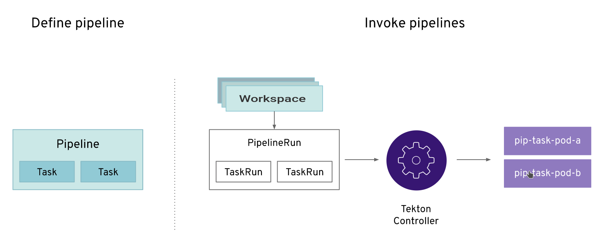
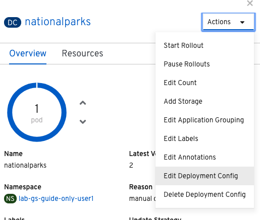
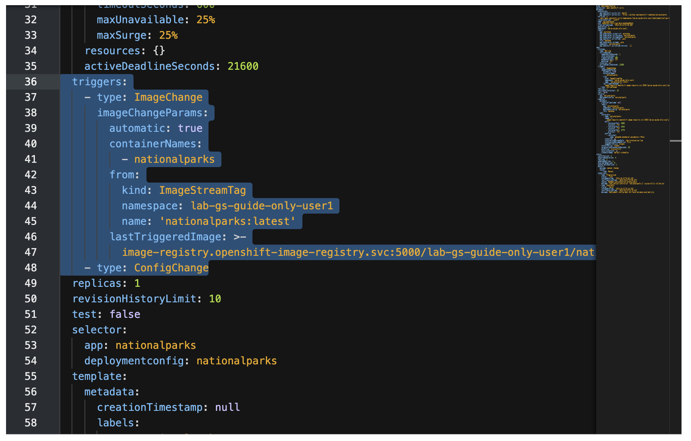
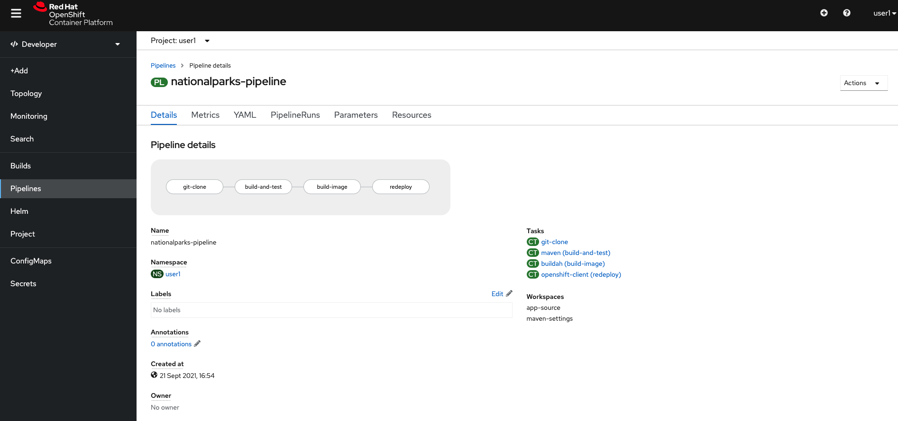

In this lab you will learn about pipelines and how to configure a pipeline in OpenShift so
that it will take care of the application lifecycle.

== Background: Continuous Integration and Pipelines

A continuous delivery (CD) pipeline is an automated expression of your process for getting software
from version control right through to your users and customers.
Every change to your software (committed in source control) goes through a complex process on
its way to being released. This process involves building the software in a reliable and repeatable
manner, as well as progressing the built software (called a "build") through multiple stages of
testing and deployment.

OpenShift Pipelines is a cloud-native, continuous integration and delivery (CI/CD) solution for building pipelines using https://tekton.dev/[Tekton]. Tekton is a flexible, Kubernetes-native, open-source CI/CD framework that enables automating deployments across multiple platforms (Kubernetes, serverless, VMs, etc) by abstracting away the underlying details.

image::images/devops-pipeline-flow.png[Pipelines]

== Understanding Tekton

Tekton defines a number of https://kubernetes.io/docs/concepts/extend-kubernetes/api-extension/custom-resources/[Kubernetes custom resources] as building blocks in order to standardize pipeline concepts and provide a terminology that is consistent across CI/CD solutions. 

The custom resources needed to define a pipeline are listed below:

* `Task`: a reusable, loosely coupled number of steps that perform a specific task (e.g. building a container image)
* `Pipeline`: the definition of the pipeline and the `Tasks` that it should perform
* `TaskRun`: the execution and result of running an instance of task
* `PipelineRun`: the execution and result of running an instance of pipeline, which includes a number of `TaskRuns`

In short, in order to create a pipeline, one does the following:

* Create custom or install https://github.com/tektoncd/catalog[existing] reusable `Tasks`
* Create a `Pipeline` and `PipelineResources` to define your application's delivery pipeline
* Create a `PersistentVolumeClaim` to provide the volume/filesystem for pipeline execution or provide a `VolumeClaimTemplate` which creates a `PersistentVolumeClaim`
* Create a `PipelineRun` to instantiate and invoke the pipeline

For further details on pipeline concepts, refer to the https://github.com/tektoncd/pipeline/tree/master/docs#learn-more[Tekton documentation] that provides an excellent guide for understanding various parameters and attributes available for defining pipelines.

== Set Up Your Pipeline

A deployment configuration in OpenShift can contain 
https://{{DOCS_URL}}/applications/deployments/what-deployments-are.html#deployments-and-deploymentconfigs_what-deployments-are[Triggers], which tells OpenShift to automatically redeploy the pod whenever a new image is built for that service or configuration changes.

As we want the Tekton pipeline to control when builds and deployments happen, we need to disable the ability
on the current Deployment to automatically trigger when there is a new image or a configuration change.

== Configure Manual Deployments on Dev Application

In the {{project_namespace}} project, click on the `nationalparks` component from Topology view. From the side panel, click on *Actions -> Edit Deployment Config*:

In the YAML for the deployment config, find the `triggers` section, delete it, and then click the blue *Save* button.

== Create Your Pipeline

As pipelines provide the ability to promote applications between different stages of the delivery cycle, Tekton, which is our Continuous Integration server that will execute our pipelines, will be deployed on a project with a Continuous Integration role. Pipelines executed in this project will have permissions to interact with all the projects modeling the different stages of our delivery cycle. 

For this example, we're going to deploy our pipeline which is stored in the same Gogs repository where we have our code. In a more real scenario, and in order to honor https://en.wikipedia.org/wiki/Infrastructure_as_Code[infrastructure as code] principles, we would store all the pipeline definitions along with every OpenShift resources definitions we would use.

[source,shell,role=execute1]
----
oc create -f http://gogs-{{INFRA_PROJECT}}.{{cluster_subdomain}}/{{username}}/nationalparks/pipeline/nationalparks-pipeline-all.yaml -n {{project_namespace}}
----

Now let's review our Tekton Pipeline:

[source,shell,role=copypaste]
----
---
apiVersion: tekton.dev/v1beta1
kind: Pipeline
metadata:
  name: nationalparks-pipeline
spec:
  params:
    - default: nationalparks
      description: The application name
      name: APP_NAME
      type: string
    - default: 'https://github.com/blues-man/nationalparks.git'
      description: The application git repository url
      name: APP_GIT_URL
      type: string
    - default: master
      description: The application git repository revision
      name: APP_GIT_REVISION
      type: string
  tasks:
    - name: git-clone
      params:
        - name: url
          value: $(params.APP_GIT_URL)
        - name: revision
          value: $(params.APP_GIT_REVISION)
        - name: submodules
          value: 'true'
        - name: depth
          value: '1'
        - name: sslVerify
          value: 'true'
        - name: deleteExisting
          value: 'true'
      taskRef:
        kind: ClusterTask
        name: git-clone
      workspaces:
        - name: output
          workspace: app-source
    - name: test-and-build
      params:
        - name: GOALS
          value:
            - package
        - name: PROXY_PROTOCOL
          value: http
      runAfter:
        - git-clone
      taskRef:
        kind: ClusterTask
        name: maven
      workspaces:
        - name: source
          workspace: app-source
        - name: maven-settings
          workspace: maven-settings
    - name: build-image
      params:
        - name: PATH_CONTEXT
          value: .
        - name: TLSVERIFY
          value: 'false'
        - name: OUTPUT_IMAGE_STREAM
          value: '$(params.APP_NAME):latest'
      runAfter:
        - test-and-build
      taskRef:
        kind: Task
        name: s2i-java-11-binary
      workspaces:
        - name: source
          workspace: app-source
    - name: redeploy
      params:
        - name: DEPLOYMENT_CONFIG
          value: $(params.APP_NAME)
      runAfter:
        - build-image
      taskRef:
        kind: Task
        name: redeploy
  workspaces:
    - name: app-source
    - name: maven-settings

----

A `Pipeline` is a user-defined model of a CD pipeline. A Pipeline’s code defines your entire build process, which typically includes stages for building an application, testing it and then delivering it.

A `Task` and a `ClusterTask` contain some step to be executed. *ClusterTasks* are available to all user within a cluster where OpenShift Pipelines has been installed, while *Tasks* can be custom.

This pipeline has 4 Tasks defined:

- *git clone*: this is a `ClusterTask` that will clone our source repository for nationalparks and store it to a `Workspace` `app-source` which will use the PVC created for it `app-source-workspace`
- *test-and-build*: will test and build our Java application using `maven` `ClusterTask`
- *build-image*: will build an image using a binary file as input in OpenShift. The build will use the .jar file that was created and a custom Task for it `s2i-java11-binary`
- *redeploy*: it will deploy the created image on OpenShift using the DeploymentConfig named `nationalparks` we created in the previous lab, using the custom Task `redeploy` 

From left-side menu, click on *Pipeline*, then click on *nationalparks-pipeline* to see the pipeline you just created.

The Pipeline is parametric, with default value on the one we need to use. 

== Run the Pipeline

In order to start the Pipeline, we can use a `PipelineRun` Custom Resource, representing our parameters to send to the pipeline:

[source,shell,role=execute1]
----
oc create -f http://gogs-{{INFRA_PROJECT}}.{{cluster_subdomain}}/{{username}}/nationalparks/pipeline/nationalparks-pipelinerun.yaml -n {{project_namespace}}
----

You can follow the Pipeline execution from *Pipeline* section, watching all the steps in progress. Click on one of the step to follow the Logs: