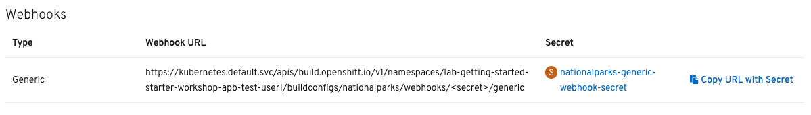
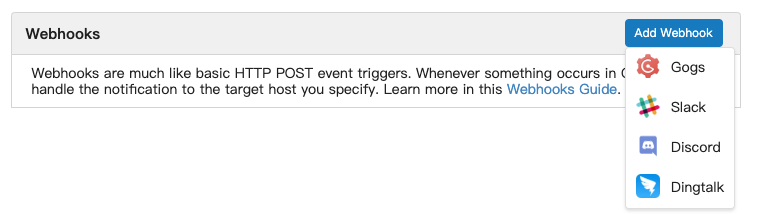
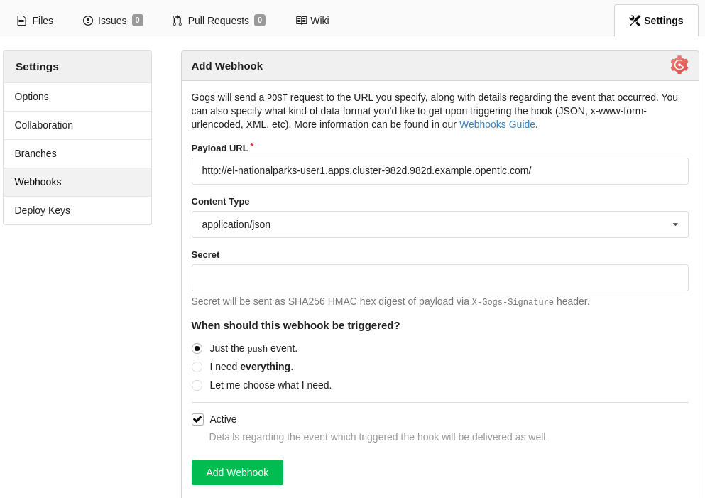

== Background: Web Hooks

Most Git repository servers support the concept of web hooks -- calling to an
external source via HTTP(S) when a change in the code repository happens.
OpenShift provides an API endpoint that supports receiving hooks from
remote systems in order to trigger builds. By pointing the code repository's
hook at the OpenShift API, automated code/build/deploy pipelines can be
achieved.

== Exercise: Configuring Gogs Web Hooks
In this lab you can use a build webhook to trigger a pipeline execution every time there is a change in the nationalparks Gogs repository. In the OpenShift web console, navigate to your `{{ project_namespace  }}` project, and then click *Builds -> Build Configs* in the left navigation. Click `nationalparks-build` build and scroll down to the Webhooks section.

On this screen you will see two webhook URLs as shown in the following image:

Note that the webhook URLs have placeholder text for the secret. We will get the real secret values in a moment. But for now, copy the Generic Webhook URL. Once you have the URL copied to your clipboard, navigate to the code repository
that you have on your local Gogs:

CAUTION: In the following url(s), replace `%username%` with the Git username provided to you.

[source,bash,role=copypaste]
----
http://gogs-{{INFRA_PROJECT}}.{{ROUTER_ADDRESS}}/%username%/nationalparks
----

[NOTE]
====
The credentials for this Gogs instance are the same as for our OpenShift instance
====

Click the Settings link on the top right of the screen:

image::images/nationalparks-codechanges-gogs-settings.png[Webhook]

Click on webhooks, and the on `Add Webhook` button.

In the next screen, paste your link into the "URL" field. You can leave the
secret token field blank -- the secret is already in the URL and does not need
to be in the payload, or copy it from the URL.

Now go back to the Build Config page and click on *YAML*. Copy the Generic secret value from the triggers section. 

image::images/nationalparks-codechanges-gogs-copy-secret.png[Secret]

Go back to Gogs and replace `<secret>` in the URL with the value you just copied.

Change the `Content Type` to `application/x-www-form-urlencoded`.

Finally, click on "Add webhook".

Boom! From now on, every time you commit new source code to your Gogs
repository, a new build and deploy will occur inside of OpenShift.  Let's try
this out.

== Exercise: Using Gogs Web Hooks
Click "Project" at the top of the Gogs page, and then "Files" towards the
middle of the page. This is Gogs's repository view. 

CAUTION: Make sure that the drop-down menu at the upper right is set for 
the *`master`* branch. Navigate to the
following path:

[source,bash]
----
bin/
----

Then click on the `config.js` file.

Once you have the file on the screen, click the edit button in the top right
hand corner as shown here:

image::images/nationalparks-codechanges-gogs-javascript-change-code.png[Webhook]

Change line number 17:

[source,javascript]
----
 displayName: "National Parks (JS)",
----

To

[source,javascript]
----
 displayName: "Amazing National Parks (JS)",
----

Click on Commit changes at the bottom of the screen. Feel free to enter a commit
message.

Once you have committed your changes, a *Build* should almost instantaneously be
triggered in OpenShift. Look at the *Builds* page in the web console, or run the
following command to verify:

[source,bash,role=copypaste]
----
oc get builds
----

You should see that a new build is running:

[source,bash]
----
NAME              TYPE      FROM          STATUS     STARTED          DURATION
nationalparks-1   Source    Git@b052ae6   Complete   18 hours ago     36s
nationalparks-2   Source    Git@3b26e1a   Running    43 seconds ago
----

Once the build and deploy has finished, verify your new image was
automatically deployed by viewing the application in your browser:

CAUTION: In the following url(s), replace `{{ project_namespace  }}` with the project provided to you.

[source,bash,role=copypaste]
----
http://nationalparks-{{ project_namespace  }}.{{ROUTER_ADDRESS}}/ws/info/
----

You should now see the new name you have set in the JSON string returned.

NOTE: To see this in the map's legend itself, you will need to scale down your parksmap to 0, then back up to 1 to force the app to refresh its cache.

== Exercise: Rollback

OpenShift allows you to move between different versions of an application
without the need to rebuild each time. Every version (past builds) of the
application exists as an image in the OpenShift registry. Using
the `oc rollback` and `oc deploy` commands you can move back- or forward between
various versions of applications.

In order to perform a rollback, you need to know the name of the *Deployment Config*
which has deployed the application:

[source,bash,role=copypaste]
----
oc get dc
----

The output will be similar to the following:

[source,bash]
----
NAME                 REVISION   DESIRED   CURRENT   TRIGGERED BY
mongodb              1          1         1         config,image(mongodb:3.6)
parksmap             2          1         1         config,image(parksmap:{{PARKSMAP_VERSION}})
nationalparks        9          1         1         config,image(nationalparks:master)
----
Now run the following command to rollback the latest code change:

[source,bash,role=copypaste]
----
oc rollback nationalparks
----

You will see output like the following:

[source,bash]
----
#5 rolled back to nationalparks-3
Warning: the following images triggers were disabled: nationalparks:live
  You can re-enable them with: oc set triggers dc/nationalparks --auto
----

Once the deploy is complete, verify that the page header is reverted to the
original header by viewing the application in your browser.

CAUTION: In the following url(s), replace `{{ project_namespace  }}` with the project provided to you.

[source,bash,role=copypaste]
----
http://nationalparks-{{ project_namespace  }}.{{ROUTER_ADDRESS}}/ws/info/
----

[NOTE]
====
Automatic deployment of new images is disabled as part of the rollback
to prevent unwanted deployments soon after the rollback is complete. To re-enable
the automatic deployments run this:

[source,bash,role=copypaste]
----
oc set triggers dc/nationalparks --auto
----
====

== Exercise: Rollforward

Just like you performed a rollback, you can also perform a roll-forward using
the same command. You'll notice above that when you requested a *rollback*, it
caused a new deployment (#3). In essence, we always move forwards in OpenShift,
even if we are going "back".

So, if we want to return to the "new code" version, that is deployment #4.

[source,bash,role=copypaste]
----
oc rollback nationalparks-4
----

And you will see the following:
[source,bash]
----
#6 rolled back to nationalparks-4
Warning: the following images triggers were disabled: nationalparks
  You can re-enable them with: oc set triggers dc/nationalparks --auto
----

Cool! Once the *rollback* is complete, verify you again see "Amazing
National Parks".
