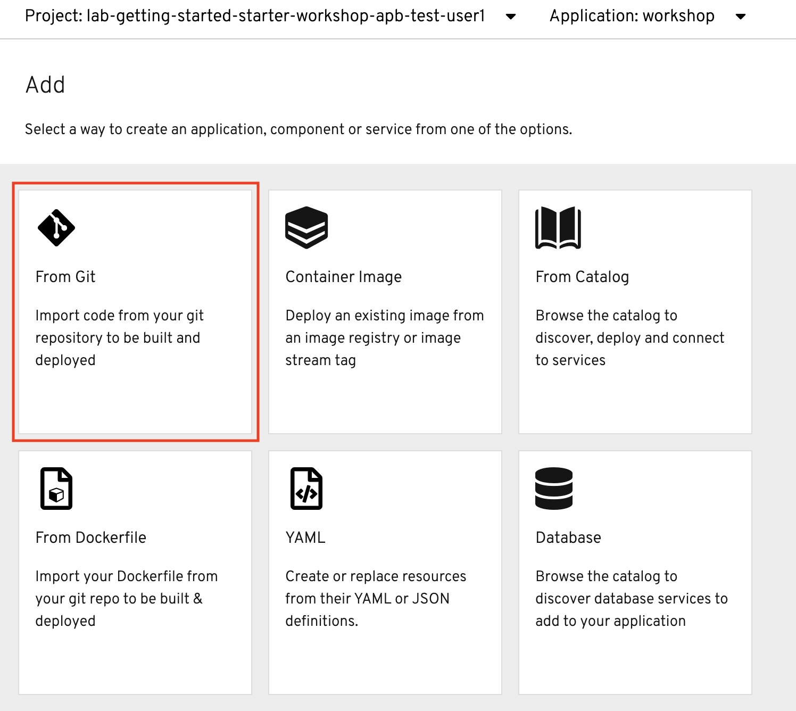
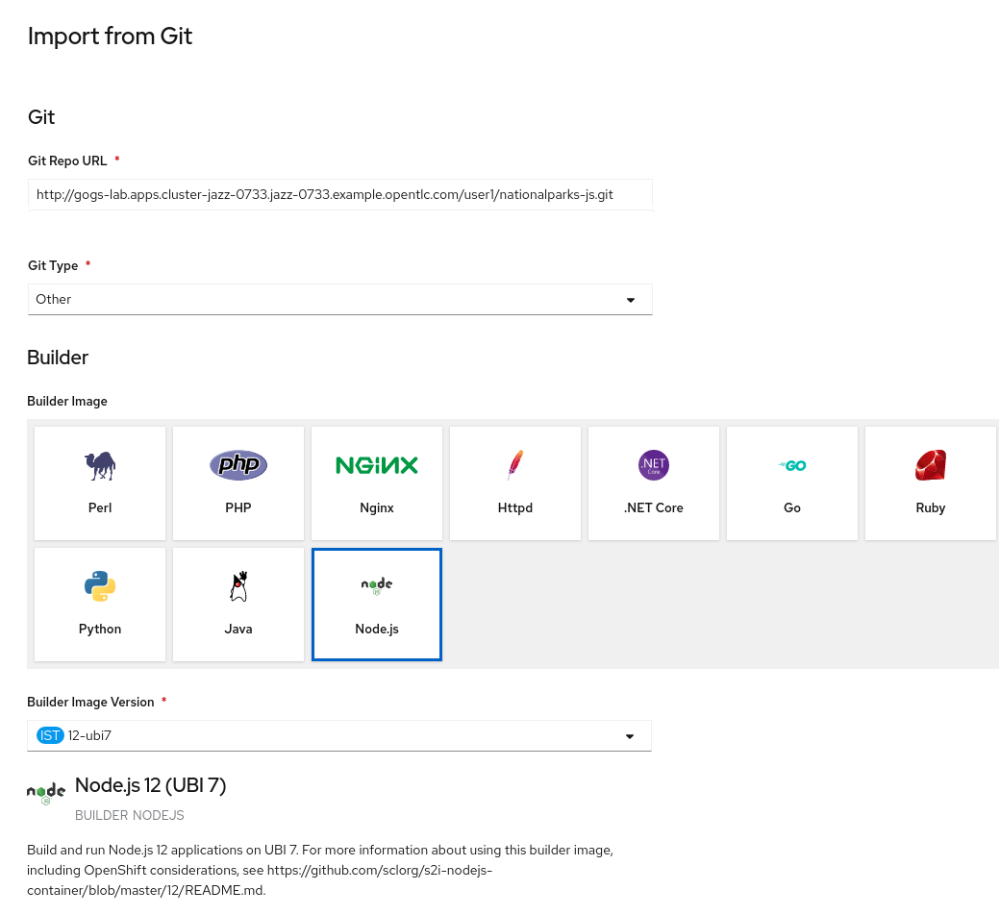
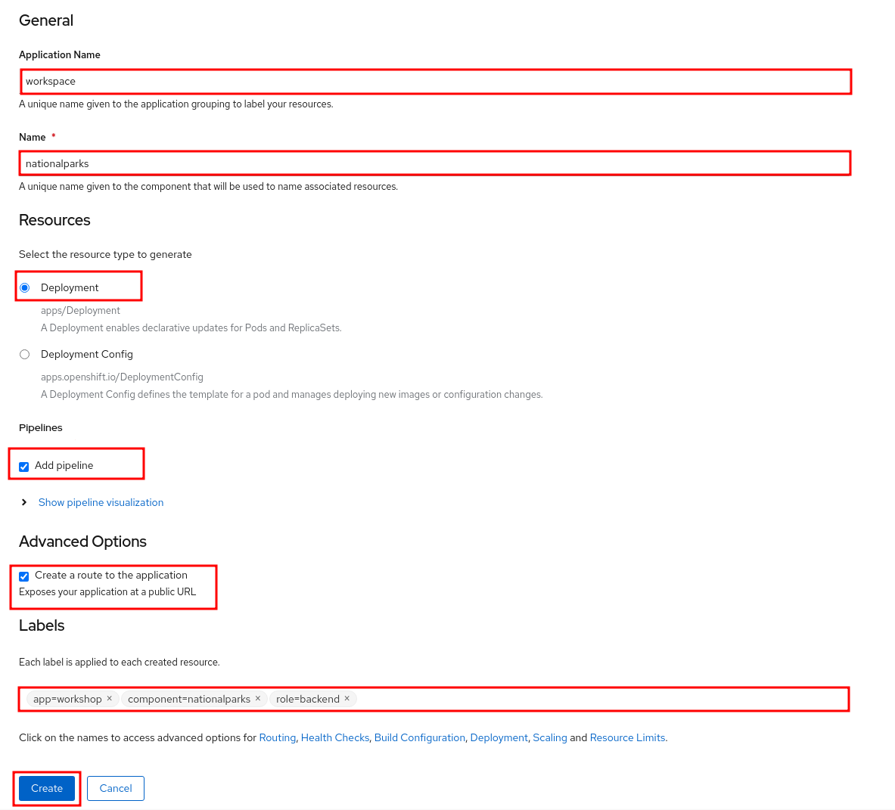
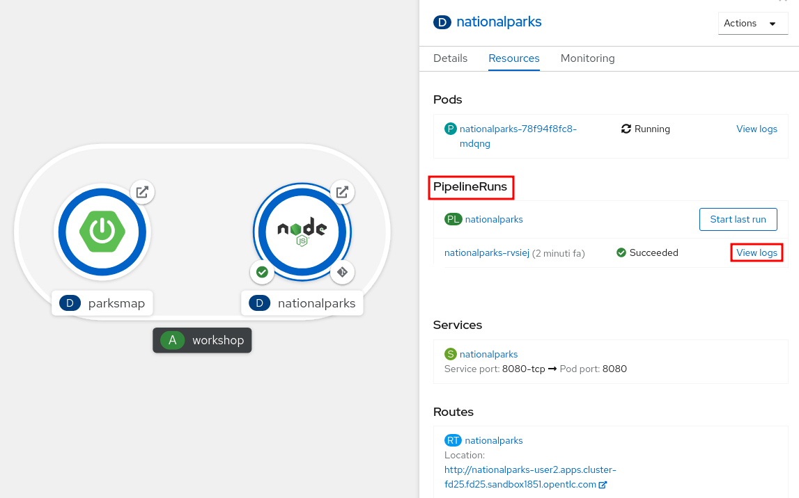
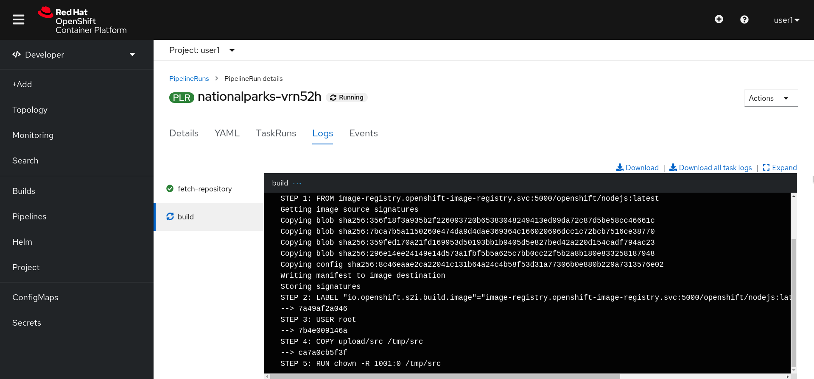

In this lab, we're going to deploy a backend service, developed in JavaScript
 that will expose 2 main REST endpoints to the visualizer
application (`parksmap` web component that was deployed in the previous labs).
The application will query for national parks information (including it's
coordinates) that is stored in a MongoDB database.  This application will also
provide an external access point, so that the API provided can be directly used
by the end user.

image::images/roadshow-app-architecture-nationalparks-1.png[Application architecture,800,align="center"]

== Background: Source-to-Image (S2I)

In a previous lab, we learned how to deploy a pre-existing container
image. Now we will expand on that by learning how OpenShift builds
container images using source code from an existing repository.  This is accomplished using the Source-to-Image project.

https://github.com/openshift/source-to-image[Source-to-Image (S2I)] is a
open source project sponsored by Red Hat that has the following goal:

[source]
----
Source-to-image (S2I) is a tool for building reproducible container images. S2I
produces ready-to-run images by injecting source code into a container image and
assembling a new image which incorporates the builder image and built
source. The result is then ready to use with docker run. S2I supports
incremental builds which re-use previously downloaded dependencies, previously
built artifacts, etc.
----

OpenShift is S2I-enabled and can use S2I as one of its build mechanisms (in
addition to building container images from Dockerfiles, and "custom" builds).

OpenShift runs the S2I process inside a special *Pod*, called a Build
Pod, and thus builds are subject to quotas, limits, resource scheduling, and
other aspects of OpenShift.

A full discussion of S2I is beyond the scope of this class, but you can find
more information about it either in the
https://{{DOCS_URL}}/openshift_images/using_images/using-s21-images.htmlOpenShift S2I documentation]
or on https://github.com/openshift/source-to-image[GitHub]. The only key concept you need to
remember about S2I is that it's magic.

== Exercise: Creating a JavaScript application

The backend service that we will be deploying as part of this exercise is
called `nationalparks`.  This is a JavaScript application that performs 2D
geo-spatial queries against a MongoDB database to locate and return map
coordinates of all National Parks in the world. That was just a fancy way of
saying that we are going to deploy a webservice that returns a JSON list of
places.

=== Add to Project
Because the `nationalparks` component is a backend to serve data that our
existing frontend (parksmap) will consume, we are going to build it inside the existing
project that we have been working with. To illustrate how you can interact with OpenShift via the CLI or the Web Console, we will deploy the nationalparks component using the web console.

=== Using application code on embedded Git server

OpenShift can work with any accessible Git repository. This could be GitHub,
GitLab, or any other server that speaks Git. You can even register webhooks in
your Git server to initiate OpenShift builds triggered by any update to the
application code!

The repository that we are going to use is already cloned in the internal Gogs repository
and located at the following URL:

link:http://gogs-{{INFRA_PROJECT}}.{{cluster_subdomain}}/{{username}}/nationalparks-js.git[Gogs Repository]

Your Gogs credentials are:

[source,bash]
----
username: {{username}}
password: {{GOGS_PASSWORD}}
----

Later in the lab, we want you to make a code change and then rebuild your
application. This is a fairly simple JavaScript application.

=== Build the Code on OpenShift

Similar to how we used *+Add* before with an existing image, we
can do the same for specifying a source code repository. Since for this lab you
have your own git repository, let's use it with a simple JavaScript S2I image.

In the Developer Perspective, click *+Add* in the left navigation and then choose "From Git"

The *Import from Git* workflow will guide you through the process of deploying your app based on a few selections.

Enter the following for Git Repo URL:

[source,role=copypaste]
----
http://gogs-{{INFRA_PROJECT}}.{{cluster_subdomain}}/{{username}}/nationalparks-js.git
----

In *Git Type* select *Other*.

NOTE: if you copied the Gogs URL correctly (check spaces etc) and you still get a warning like 'URL is valid but cannot be reached' please ignore it at this time, since the UI may fail to ping the repo sometimes.

Select *Node.js* as your Builder Image and pick *latest* version.

NOTE: All of these builder images shown are made available via *Templates* and
*ImageStreams*, which will be discussed in a later lab.

Scroll down to the *General* section. Select `workshop` as your application, and `nationalparks` as the name.

Scroll down to the *General* section. Select:

* *Application Name* : workshop
* *Name* : nationalparks

In *Resources* section, select *Deployment*.

Inside *Pipeline* section, check *Add pipeline* box. This will create a Tekton Pipeline for us that we will use after in the Pipeline modules.

TIP: Click "Show pipeline visualization" to preview the Pipeline inside Pipeline UI that we are going to use later on.

Expand the Labels section and add 3 labels:

The name of the Application group:

[source,role=copy]
----
app=workshop
----

Next the name of this deployment.

[source,role=copy]
----
component=nationalparks
----

And finally, the role this component plays in the overall application.

[source,role=copy]
----
role=backend
----

Now click the *Create* button.

At this point, OpenShift will build the app and create a container through the Pipeline we just added.

TIP: We will discuss more in details about OpenShift Pipelines in the *Continuous Integration and Pipelines* module.

To see the build logs, in the Topology view, click the `nationalparks` entry. Inside *Resources* tab, go to *PipelineRuns* section and click to *View Logs* link next to running pipeline.

Your newly created pipeline is running to build the backend from he source code and push the resulting  container image to the OpenShift Registry.

The initial build will take a few minutes to download all of the dependencies needed for
the application.

After the build has completed and successfully:

* The S2I process will push the resulting container image to the internal OpenShift registry
* The *Deployment* (D) will detect that the image has changed, and this
  will cause a new deployment to happen.
* A *ReplicaSet* (RS) will be spawned for this new deployment.
* The RC will detect no *Pods* are running and will cause one to be deployed, as our default replica count is just 1.

In the end, when issuing the `oc get pods` command, you will see that the each step of the pipeline has been executed inside a Pod (Completed) and that an application *Pod* is in a ready and running state:

[source,bash]
----
NAME                    READY     STATUS      RESTARTS   AGE
nationalparks-757df44bd4-hnrxc                          1/1     Running     0          2m23s
nationalparks-vrn52h-build-m5nmf-pod-r4p2z              0/4     Completed   0          4m26s
nationalparks-vrn52h-deploy-pv6nx-pod-vwx62             0/1     Completed   0          2m22s
nationalparks-vrn52h-fetch-repository-4wjkm-pod-4zxm6   0/1     Completed   0          5m27s
----

If you look again at the web console, you will notice that, when you create the
application this way, OpenShift also creates a *Route* for you. You can see the
URL in the web console, or via the command line:

[source,bash,role=execute-1]
----
oc get routes
----

Where you should see something like the following:

[source,bash]
----
NAME            HOST/PORT                                                   PATH      SERVICES        PORT       TERMINATION
nationalparks   nationalparks-{{project_namespace}}.{{cluster_subdomain}}             nationalparks   8080-tcp
parksmap        parksmap-{{project_namespace}}.{{cluster_subdomain}}                  parksmap        8080-tcp
----

In the above example, the URL is:

[source,bash,role=copypaste]
----
http://nationalparks-{{project_namespace}}.{{cluster_subdomain}}
----

Since this is a back-end application, it doesn't actually have a web interface.
However, it can still be used with a browser. All backends that work with the parksmap
frontend are required to implement a `/ws/info/` endpoint. To test, visit this URL in your browser:

link:http://nationalparks-{{project_namespace}}.{{cluster_subdomain}}/ws/info/[National Parks Info Page]

WARNING: The trailing slash is *required*.

You will see a simple JSON string:

[source,json]
----
{"id":"nationalparks-js","displayName":"National Parks (JS)","center":{"latitude":"47.039304","longitude":"14.505178"},"zoom":4}
----

Earlier we said:

[source,bash]
----
This is a JavaScript application that performs 2D geo-spatial queries
against a MongoDB database
----

But we don't have a database. Yet.
