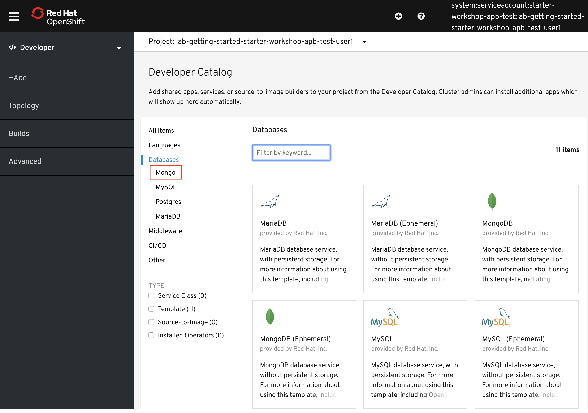
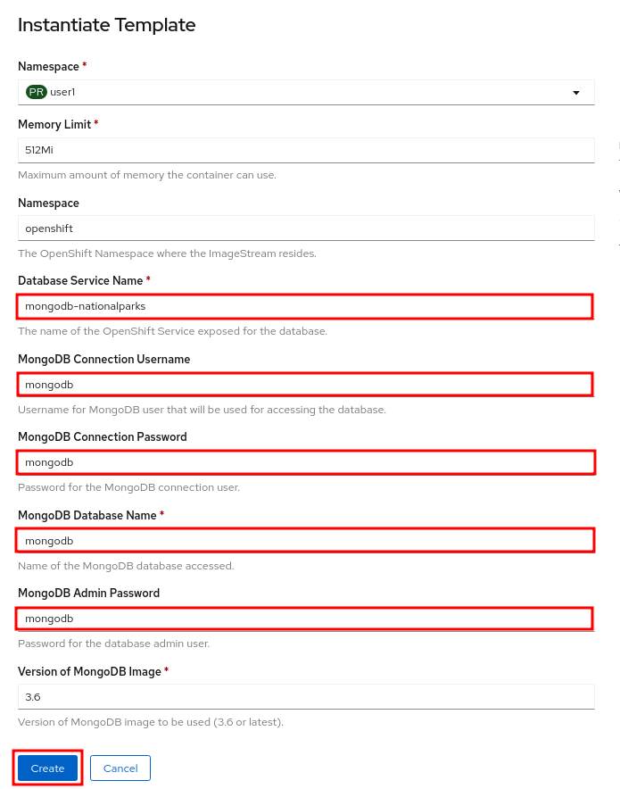
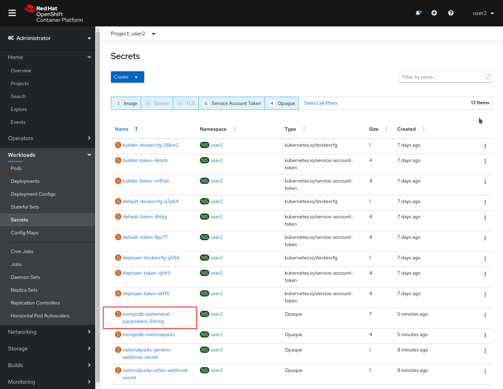
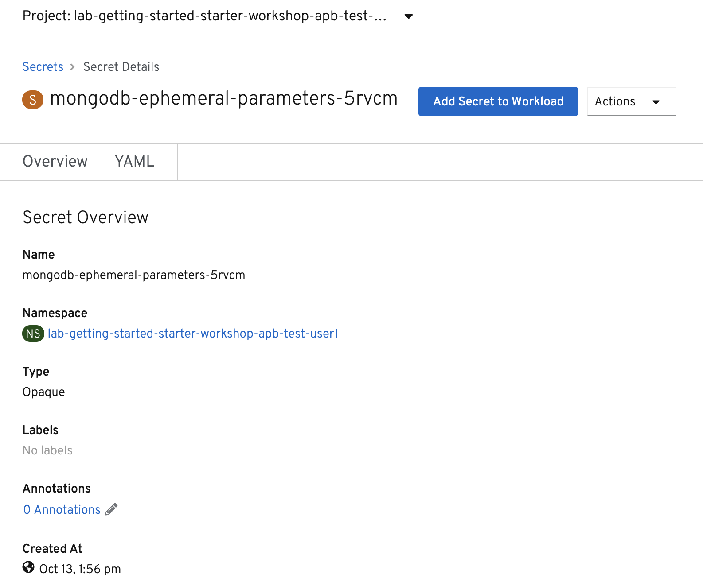
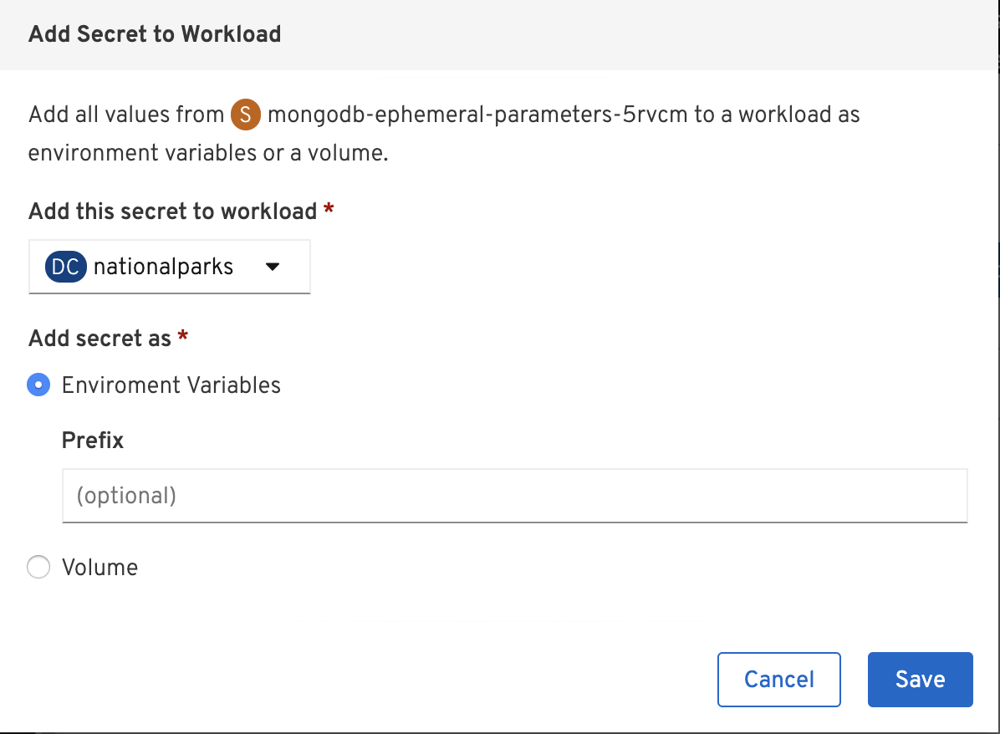
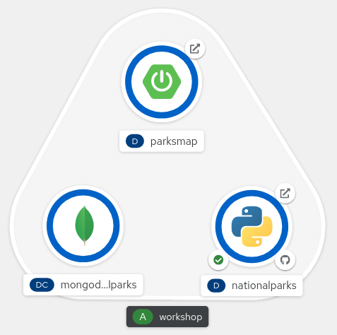
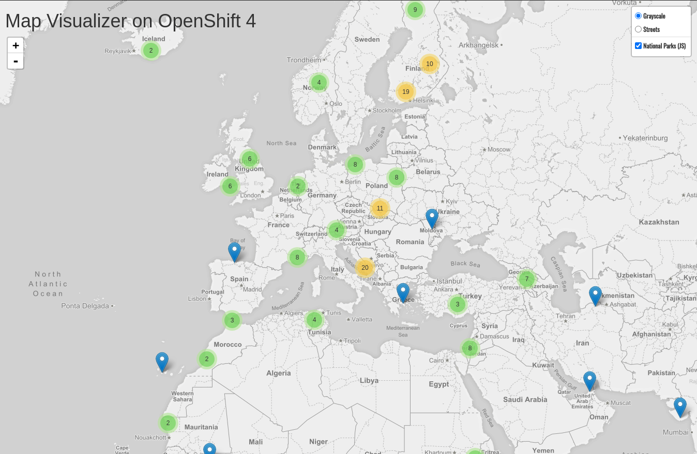

In this section, we're going to deploy a MongoDB database that will be used to store
the data for the `nationalparks` application. We will also connect the
`nationalparks` service with the newly deployed MongoDB database, so that the
`nationalparks` service can load and query the database for the corresponding
information.

Finally, we will mark the `nationalparks` application as a backend for the map
visualization tool, so that it can be dynamically discovered by the `parksmap`
component using the OpenShift discovery mechanism and the map will be displayed
automatically.

image::images/roadshow-app-architecture-nationalparks-2.png[Application architecture,800,align="center"]

== Background: Storage

Most useful applications are "stateful" or "dynamic" in some way, and this is
usually achieved with a database or other data storage. In this lab we are
going to add MongoDB to our `nationalparks` application and then rewire it to
talk to the database using environment variables via a secret.

We are going to use the MongoDB image that is included with OpenShift.

By default, this will use *EmptyDir* for data storage, which means if the *Pod*
disappears the data does as well. In a real application you would use
OpenShift's persistent storage mechanism to attach real-world storage (NFS,
Gluster, EBS, etc) to the *Pods* to give them a persistent place to store their
data.

== Exercise: Deploy MongoDB

As you've seen so far, the web console makes it very easy to deploy things onto
OpenShift. When we deploy the database, we pass in some values for configuration.
These values are used to set the username, password, and name of
the database.

The database image is built in a way that it will automatically configure itself
using the supplied information (assuming there is no data already present in the
persistent storage!). The image will ensure that:

- A database exists with the specified name
- A user exists with the specified name
- The user can access the specified database with the specified password

In the Developer Perspective in your `{{ project_namespace }}` project,
click *+Add* and then *Database*. In the Databases view, you can click *Mongo* to filter for just MongoDB.

Alternatively, you could type `mongodb` in the search box. Once you have drilled down to see MongoDB, find the *MongoDB (Ephemeral)* template and select it.  You will notice that there are multiple
MongoDB templates available.  We do not need a database with persistent storage, so the ephemeral Mongo
template is what you should choose.  Go ahead and select the ephemeral template and click the *Instantiate Template* button.

When we performed the application build, there was no template. Rather, we selected the
builder image directly and OpenShift presented only the standard build workflow.
Now we are using a template - a preconfigured set of resources that includes
parameters that can be customized. In our case, the parameters we are concerned
with are -- user, password, database, and
admin password.

CAUTION: Make sure you name your database service name *mongodb-nationalparks*

You can see that some of the fields say *"generated if empty"*. This is a
feature of *Templates* in OpenShift. For
now, be sure to use the following values in their respective fields:

* `Database Service Name` : `mongodb-nationalparks`
* `MongoDB Connection Username` : `mongodb`
* `MongoDB Connection Password` : `mongodb`
* `MongoDB Database Name`: `mongodb`
* `MongoDB Admin Password` : `mongodb`

CAUTION: Make sure to have configured the *`MongoDB Database Name`* parameter with the appropriate value as by default it will already have a value of `sampledb`.

Once you have entered in the above information, click on *Create* to go to the next step which will allow us to add a binding.

From left-side menu, click to *Secrets*.

Click the secret name listed under *Parameters*. The secret can be used in other components, such as the `nationalparks` backend, to authenticate to the database.

Now that the connection and authentication information stored in a secret in our project, we need to add it to the `nationalparks` backend. Click the *Add Secret to Workload* button.

Select the `nationalparks` workload and click *Save*.

This change in configuration will trigger a new deployment of the `nationalparks` application with the environment variables properly injected.

Back in the *Topology* view, click and drag the `mongodb-nationalparks` component into the light gray area that denotes the `workshop` application, so that all three components are contained in it.

Next, let's fix the labels assigned to the `mongodb-nationalparks` deployment. Currently, we cannot set labels when using the database template from the catalog, so we will fix these labels manually. 

Like before, we'll add 3 labels:

- *__app__=workshop*  (the name we will be giving to the app)
- *__component__=nationalparks*  (the name of this deployment)
- *__role__=database* (the role this component plays in the overall application)

Execute the following command:
[source,bash,role=execute-1]
----
oc label dc/mongodb-nationalparks svc/mongodb-nationalparks app=workshop component=nationalparks role=database --overwrite
----

== Exercise: Exploring OpenShift Magic
As soon as we changed the *DeploymentConfiguration*, some
magic happened. OpenShift decided that this was a significant enough change to
warrant updating the internal version number of the *DeploymentConfiguration*. You
can verify this by looking at the output of `oc get dc`:

[source,bash]
----
NAME                    REVISION   DESIRED   CURRENT   TRIGGERED BY
mongodb-nationalparks   1          1         1         config,image(mongodb:3.6)
nationalparks           2          1         1         config,image(nationalparks:master)
parksmap                2          1         1         config,image(parksmap:{{PARKSMAP_VERSION}}))
----

Something that increments the version of a *DeploymentConfiguration*, by default,
causes a new deployment. You can verify this by looking at the output of `oc get
rc`:

[source,bash]
----
NAME                      DESIRED   CURRENT   READY     AGE
mongodb-nationalparks-1   1         1         1         24m
nationalparks-1           0         0         0         3h
nationalparks-2           1         1         1         8m
parksmap-1                0         0         0         6h
parksmap-2                1         1         1         5h
----

We see that the desired and current number of instances for the "-1" deployment
is 0. The desired and current number of instances for the "-2" deployment is 1.
This means that OpenShift has gracefully torn down our "old" application and
stood up a "new" instance.

== Exercise: Data, Data, Everywhere

Now that we have a database deployed, we can again visit the `nationalparks` web
service to query for data:

[source,bash,role=copypaste]
----
http://nationalparks-{{ project_namespace }}.{{cluster_subdomain}}/ws/data/all
----

And the result?

[source,bash]
----
[]
----

Where's the data? Think about the process you went through. You deployed the
application and then deployed the database. Nothing actually loaded anything
*INTO* the database, though.

The application provides an endpoint to do just that:

[source,bash,role=copypaste]
----
http://nationalparks-{{ project_namespace }}.{{cluster_subdomain}}/ws/data/load
----

And the result?

[source,bash]
----
Items inserted in database: 2762
----

If you then go back to `/ws/data/all` you will see tons of JSON data now.
That's great. Our parks map should finally work!

NOTE: There's some errors reported with browsers like firefox 54 that don't properly parse the resulting JSON. It's
a browser problem, and the application is working properly.

[source,bash,role=copypaste]
----
http://parksmap-{{ project_namespace }}.{{cluster_subdomain}}
----

Hmm... There's just one thing. The main map **STILL** isn't displaying the parks.
That's because the front end parks map only tries to talk to services that have
the right *Label*.

[NOTE]
====
You are probably wondering how the database connection magically started
working? When deploying applications to OpenShift, it is always best to use
environment variables, secrets, or configMaps to define connections to dependent systems.  This allows
for application portability across different environments.  The source file that
performs the connection as well as creates the database schema can be viewed
here:

[source,bash,role=copypaste]
----
https://github.com/openshift-roadshow/nationalparks-py/blob/master/wsgi.py#L11-L18
----

In short summary: By referring to bindings to connect to services
(like databases), it can be trivial to promote applications throughout different
lifecycle environments on OpenShift without having to modify application code.

====

== Exercise: Working With Labels

We explored how a *Label* is just a key=value pair earlier when looking at
*Services* and *Routes* and *Selectors*. In general, a *Label* is simply an
arbitrary key=value pair. It could be anything.

* `pizza=pepperoni`
* `pet=dog`
* `openshift=awesome`

In the case of the parks map, the application is actually querying the OpenShift
API and asking about the *Routes* and *Services* in the project. If any of them have a
*Label* that is `type=parksmap-backend`, the application knows to interrogate
the endpoints to look for map data.
You can see the code that does this
link:https://github.com/openshift-roadshow/parksmap-web/blob/{{PARKSMAP_VERSION}}/src/main/java/com/openshift/evg/roadshow/rest/RouteWatcher.java#L20[here].

Fortunately, the command line provides a convenient way for us to manipulate
labels. `describe` the `nationalparks` service:

[source,bash,role=execute-1]
----
oc describe route nationalparks
----

[source,bash]
----
Name:                   nationalparks
Namespace:              {{ project_namespace }}
Created:                2 hours ago
Labels:                 app=workshop
                        app.kubernetes.io/component=nationalparks
                        app.kubernetes.io/instance=nationalparks
                        app.kubernetes.io/name=python
                        app.kubernetes.io/part-of=workshop
                        app.openshift.io/runtime=python
                        app.openshift.io/runtime-version=3.6
                        component=nationalparks
                        role=backend  
Annotations:            openshift.io/host.generated=true                          
Requested Host:         nationalparks-{{ project_namespace }}.{{cluster_subdomain}}
                        exposed on router router 2 hours ago
Path:                   <none>
TLS Termination:        <none>
Insecure Policy:        <none>
Endpoint Port:          8080-tcp

Service:                nationalparks
Weight:                 100 (100%)
Endpoints:              10.1.9.8:8080
----

You see that it already has some labels. Now, use `oc label`:

[source,bash,role=execute-1]
----
oc label route nationalparks type=parksmap-backend
----

You will see something like:

[source,bash]
----
route.route.openshift.io/nationalparks labeled
----

If you check your browser now:

[source,bash,role=copypaste]
----
http://parksmap-{{ project_namespace }}.{{cluster_subdomain}}/
----

You'll notice that the parks suddenly are showing up. That's really cool!
