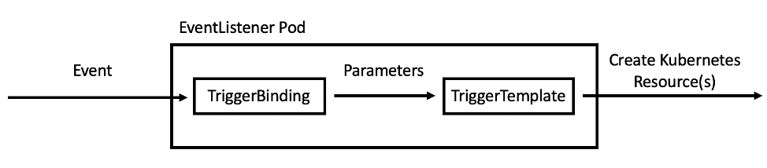
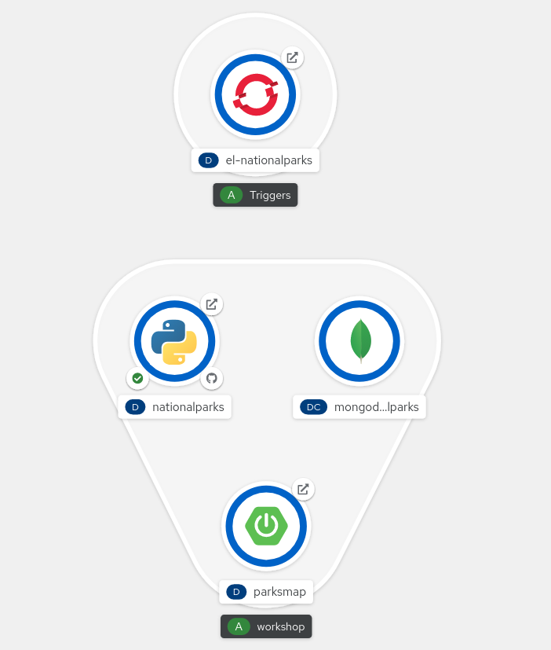
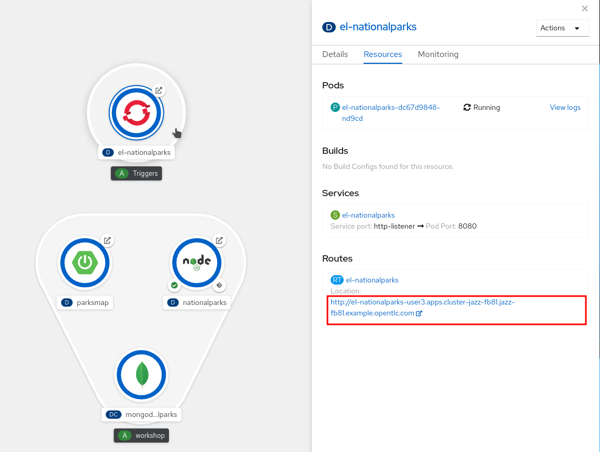
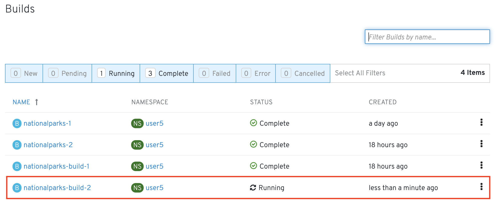

== Background: Web Hooks

Most Git repository servers support the concept of web hooks -- calling to an
external source via HTTP(S) when a change in the code repository happens.
OpenShift provides an API endpoint that supports receiving hooks from
remote systems in order to trigger builds. By pointing the code repository's
hook at the OpenShift Pipelines resources, automated code/build/deploy pipelines can be
achieved.

== Adding Triggers to your Pipeline

Tekton *Triggers* enable us to configure Pipelines to respond to external events (Git push events, pull requests etc) such as Web Hooks.

Adding triggering support requires the creation of a `TriggerTemplate`, `TriggerBinding`, and an `EventListener` in our project.

Let's see each component in detail:

* *TriggerTemplate*: a trigger template is a template for newly created resources. It supports parameters to create specific `PipelineResources` and `PipelineRuns`.
* *TriggerBinding*: validates events and extracts payload fields
* *EventListener*: connects `TriggerBindings` and `TriggerTemplates` into an addressable endpoint (the event sink). It uses the extracted event parameters from each TriggerBinding (and any supplied static parameters) to create the resources specified in the corresponding TriggerTemplate. It also optionally allows an external service to pre-process the event payload via the interceptor field.

Now let's create them all together for our Pipeline:

[source,shell,role=execute-1]
----
oc create -f http://gogs-{{INFRA_PROJECT}}.{{cluster_subdomain}}/{{username}}/nationalparks-py/raw/master/pipelines/nationalparks-triggers-all.yaml -n {{project_namespace}}
----

This will create a new Pod with a Route that we can use to setup our Webhook on Gogs to trigger the automatic start of the Pipeline.

From left side menu, click on *Topology* to verify if a new Deployment *el-nationalparks* for the `EventListener` has ben created:

== Exercise: Configuring Gogs Web Hooks

Click on the Deployment, go into *Routes* section and and copy the *el-nationparks* Route URL.

Once you have the URL copied to your clipboard, navigate to the code repository that you have on Gogs:

link:http://gogs-{{INFRA_PROJECT}}.{{cluster_subdomain}}/{{username}}/nationalparks-py[Gogs Repository]

Your Gogs credentials are:

[source,bash]
----
username: {{username}}
password: {{GOGS_PASSWORD}}
----

Click the Settings link on the top right of the screen:

image::images/nationalparks-codechanges-gogs-settings.png[Webhook]

Click on *Webhooks*, then the *Add Webhook* button, and finally select *Gogs*.

image::images/nationalparks-codechanges-gogs-add-webhook.png[Webhook]

In the next screen, paste your link into the "Payload URL" field. You can leave the
secret token field blank -- the secret is already in the URL and does not need
to be in the payload.

Change the `Content Type` to `application/json`.

Finally, click on *Add Webhook*.

image::images/nationalparks-codechanges-gogs-config-webhook.png[Webhook]

Boom! From now on, every time you commit new source code to your Gogs
repository, a new build and deploy will occur inside of OpenShift.  Let's try
this out.

== Exercise: Using Gogs Web Hooks

Click the *Files* tab in Gogs. This is Gogs's repository view.  

CAUTION: Make sure that the drop-down menu at the upper right is set for 
the *`master`* branch. Navigate to the
following path:

[source,bash]
----
/
----

Then click on the `wsgi.py` file.

Once you have the file on the screen, click the edit button in the top right
hand corner as shown here:

image::images/nationalparks-codechanges-gogs-python-change-code.png[Webhook]

Change line number 48:

[source,python]
----
 'displayName': 'National Parks (PY)',
----

To

[source,python]
----
 'displayName': 'Amazing National Parks (PY)',
----

Click on Commit changes at the bottom of the screen. Feel free to enter a commit
message.

Once you have committed your changes, a new *PipelineRun* should almost instantaneously be
triggered in OpenShift. Click *Pipeline* in the left navigation menu then `nationalparks-pipeline`. You should see a new one running: 

or run the following command to verify:

[source,bash,role=execute-1]
----
oc get PipelineRun
----

Once the build and deploy has finished, verify your new image was automatically deployed by viewing the application in your browser:

link:http://nationalparks-{{project_namespace}}.{{cluster_subdomain}}/ws/info/[National Parks Info Page]

You should now see the new name you have set in the JSON string returned.

NOTE: To see this in the map's legend itself, you will need to scale down your parksmap to 0, then back up to 1 to force the app to refresh its cache.
