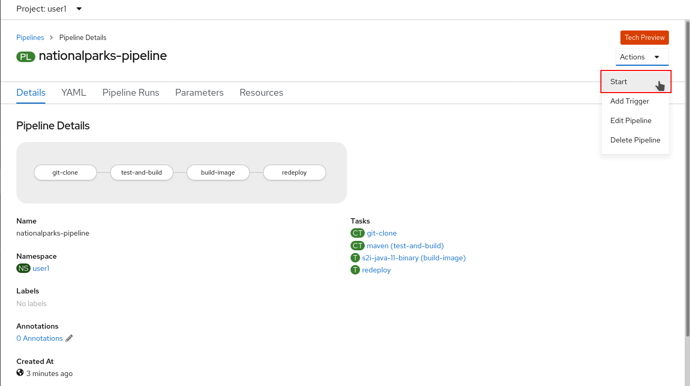
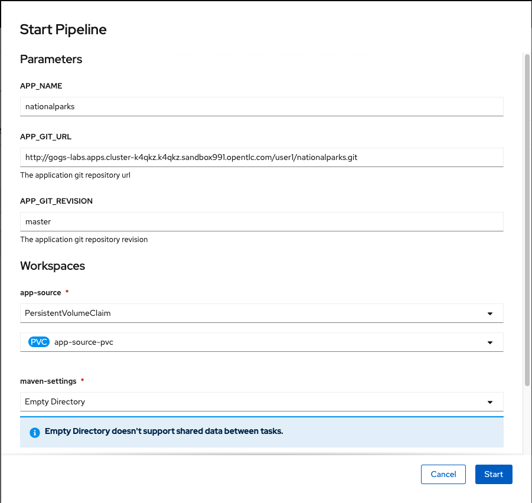
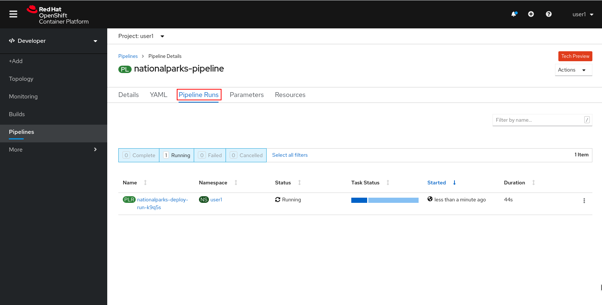
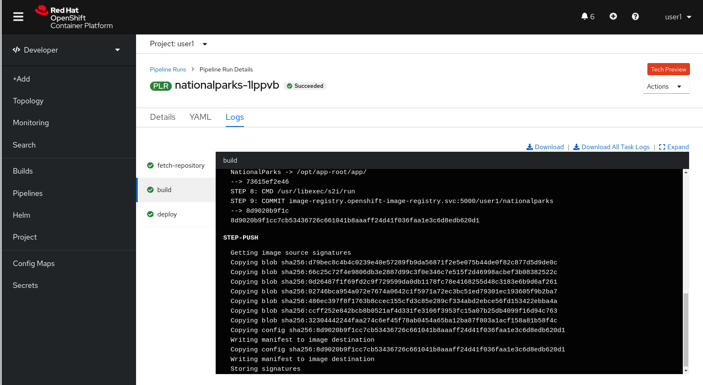
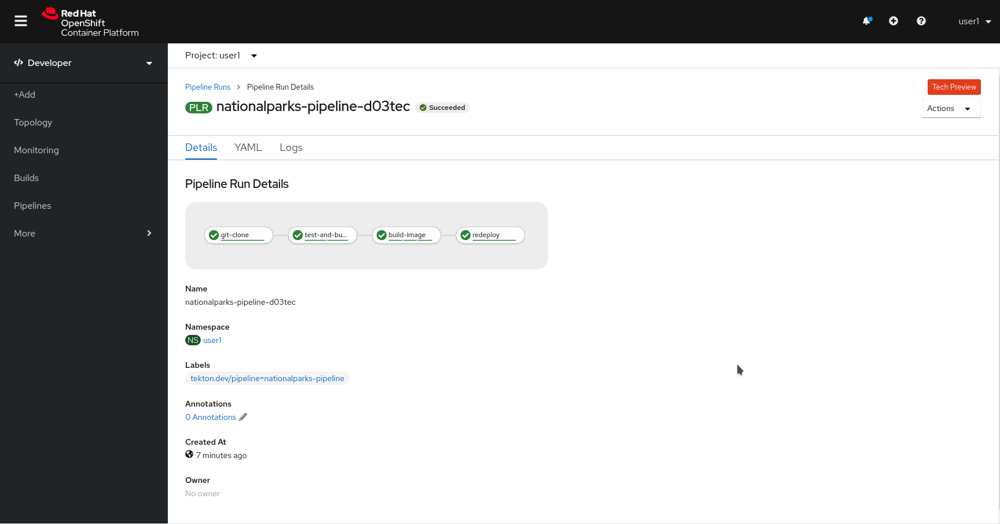

In this lab you will learn about pipelines and how to configure a pipeline in OpenShift so
that it will take care of the application lifecycle.

== Background: Continuous Integration and Pipelines

A continuous delivery (CD) pipeline is an automated expression of your process for getting software
from version control right through to your users and customers.
Every change to your software (committed in source control) goes through a complex process on
its way to being released. This process involves building the software in a reliable and repeatable
manner, as well as progressing the built software (called a "build") through multiple stages of
testing and deployment.

OpenShift Pipelines is a cloud-native, continuous integration and delivery (CI/CD) solution for building pipelines using https://tekton.dev/[Tekton]. Tekton is a flexible, Kubernetes-native, open-source CI/CD framework that enables automating deployments across multiple platforms (Kubernetes, serverless, VMs, etc) by abstracting away the underlying details.

image::images/devops-pipeline-flow.png[Pipelines]

== Understanding Tekton

Tekton defines a number of https://kubernetes.io/docs/concepts/extend-kubernetes/api-extension/custom-resources/[Kubernetes custom resources] as building blocks in order to standardize pipeline concepts and provide a terminology that is consistent across CI/CD solutions. 

The custom resources needed to define a pipeline are listed below:

* `Task`: a reusable, loosely coupled number of steps that perform a specific task (e.g. building a container image)
* `Pipeline`: the definition of the pipeline and the `Tasks` that it should perform
* `TaskRun`: the execution and result of running an instance of task
* `PipelineRun`: the execution and result of running an instance of pipeline, which includes a number of `TaskRuns`

image::images/tekton-architecture.png[Tekton Architecture]

In short, in order to create a pipeline, one does the following:

* Create custom or install https://github.com/tektoncd/catalog[existing] reusable `Tasks`
* Create a `Pipeline` and `PipelineResources` to define your application's delivery pipeline
* Create a `PersistentVolumeClaim` to provide the volume/filesystem for pipeline execution or provide a `VolumeClaimTemplate` which creates a `PersistentVolumeClaim`
* Create a `PipelineRun` to instantiate and invoke the pipeline

For further details on pipeline concepts, refer to the https://github.com/tektoncd/pipeline/tree/master/docs#learn-more[Tekton documentation] that provides an excellent guide for understanding various parameters and attributes available for defining pipelines.

== Explore your Pipeline

As pipelines provide the ability to promote applications between different stages of the delivery cycle, Tekton, which is our Continuous Integration server that will execute our pipelines, will be deployed on a project with a Continuous Integration role. Pipelines executed in this project will have permissions to interact with all the projects modeling the different stages of our delivery cycle. 

For this example, we're going to deploy our pipeline that we created automatically from Developer Console together with `nationalparks` backend. 

Verify Tasks already available in the OpenShift cluster (ClusterTasks):

[source,shell,role=execute-1]
----
oc get clustertasks -n {{project_namespace}}
----

You should see something similar:

[source,bash]
----
NAME                 AGE
....
s2i-python-3               4h58m
s2i-python-3-pr            4h58m
....
----

Verify the Pipeline we created:

[source,shell,role=execute-1]
----
oc get pipelines -n {{project_namespace}}
----

You should see something like this:

[source,bash]
----
NAME                     AGE
nationalparks   8s
----

Now let's review our Tekton Pipeline:

[source,yaml,role=copypaste]
----
---
apiVersion: tekton.dev/v1beta1
kind: Pipeline
metadata:
  name: nationalparks
spec:
  params:
    - default: nationalparks
      name: APP_NAME
      type: string
    - default: >-
        https://github.com/openshift-roadshow/nationalparks-py.git
      name: GIT_REPO
      type: string
    - default: master
      name: GIT_REVISION
      type: string
    - default: 'image-registry.openshift-image-registry.svc:5000/user1/nationalparks'
      name: IMAGE_NAME
      type: string
    - default: .
      name: PATH_CONTEXT
      type: string
    - default: '1'
      name: MINOR_VERSION
      type: string
  tasks:
    - name: fetch-repository
      params:
        - name: url
          value: $(params.GIT_REPO)
        - name: revision
          value: $(params.GIT_REVISION)
        - name: subdirectory
          value: ''
        - name: deleteExisting
          value: 'true'
      taskRef:
        kind: ClusterTask
        name: git-clone
      workspaces:
        - name: output
          workspace: workspace
    - name: build
      params:
        - name: IMAGE
          value: $(params.IMAGE_NAME)
        - name: TLSVERIFY
          value: 'false'
        - name: PATH_CONTEXT
          value: $(params.PATH_CONTEXT)
        - name: MINOR_VERSION
          value: $(params.MINOR_VERSION)
      runAfter:
        - fetch-repository
      taskRef:
        kind: ClusterTask
        name: s2i-python-3
      workspaces:
        - name: source
          workspace: workspace
    - name: deploy
      params:
        - name: SCRIPT
          value: kubectl $@
        - name: ARGS
          value:
            - rollout
            - status
            - deploy/$(params.APP_NAME)
      runAfter:
        - build
      taskRef:
        kind: ClusterTask
        name: openshift-client
  workspaces:
    - name: workspace

----

A `Pipeline` is a user-defined model of a CD pipeline. A Pipeline’s code defines your entire build process, which typically includes stages for building an application, testing it and then delivering it.

A `Task` and a `ClusterTask` contain some step to be executed. *ClusterTasks* are available to all user within a cluster where OpenShift Pipelines has been installed, while *Tasks* can be custom.

This pipeline has 4 Tasks defined:

- *fetch-repository*: this is a `ClusterTask` that will clone our source repository for nationalparks and store it to a `Workspace` `app-source` which will use the PVC created for it `app-source-workspace`
- *build*: will build and test our Python application, generate and push a container image automatically with compiled binaries inside OpenShift Container Registry.
- *deploy*: it will deploy the created image on OpenShift using the Deployment named `nationalparks` we created in the previous lab.

From left-side menu, click on *Pipeline*, then click on *nationalparks* to see the pipeline you just created.

image::images/devops-pipeline-created.png[Pipeline created]

The Pipeline is parametric, with default value on the one we need to use.

It is using one *Workspace*:

- *app-source*: linked to a *PersistentVolumeClaim* `app-source-pvc` created from the YAML template we used in previous command. This will be used to store the artifact to be used in different *Task*

== Run the Pipeline

We can start now the Pipeline from the Web Console. From left-side menu, click on *Pipeline*, then click on *nationalparks*. From top-right *Actions* list, click on *Start*.

You will be prompted with parameters to add the Pipeline, showing default ones. 

Add in *GIT_URL* the `nationalparks` repository you have in Gogs:

[source,role=copypaste]
----
http://gogs-{{INFRA_PROJECT}}.{{cluster_subdomain}}/{{username}}/nationalparks-py.git
----

In *Workspaces*-> *app-source* select *PVC* from the list, then select *app-source-pvc*. This is the share volume used by Pipeline Tasks in your Pipeline containing the source code and compiled artifacts.

Click on *Start* to run your Pipeline.

You can follow the Pipeline execution from *Pipeline* section, watching all the steps in progress. Click on *Pipeline Runs* tab to see it running:

The click on the `PipelineRun` *national-parks-deploy-run-*:

image::images/devops-pipeline-run-2.png[Pipeline running animation]

Then click on the *Task* running to check logs:

Verify PipelineRun has been completed with success:

