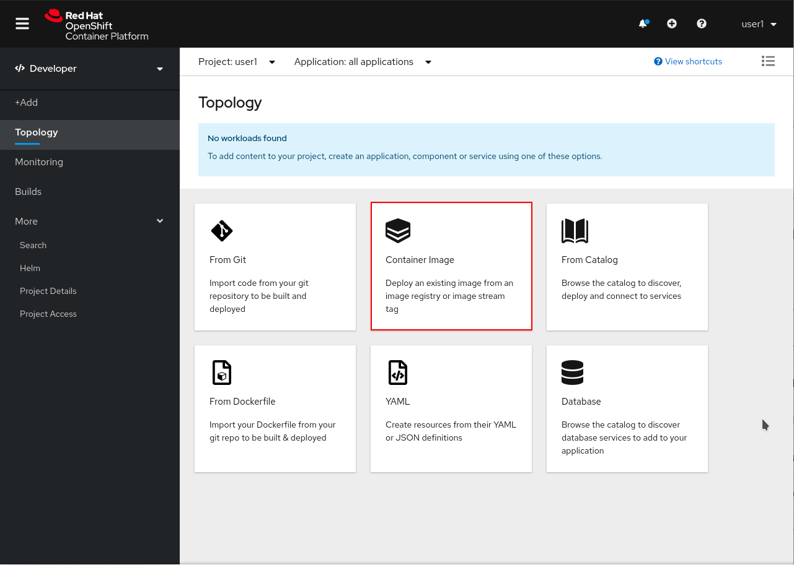
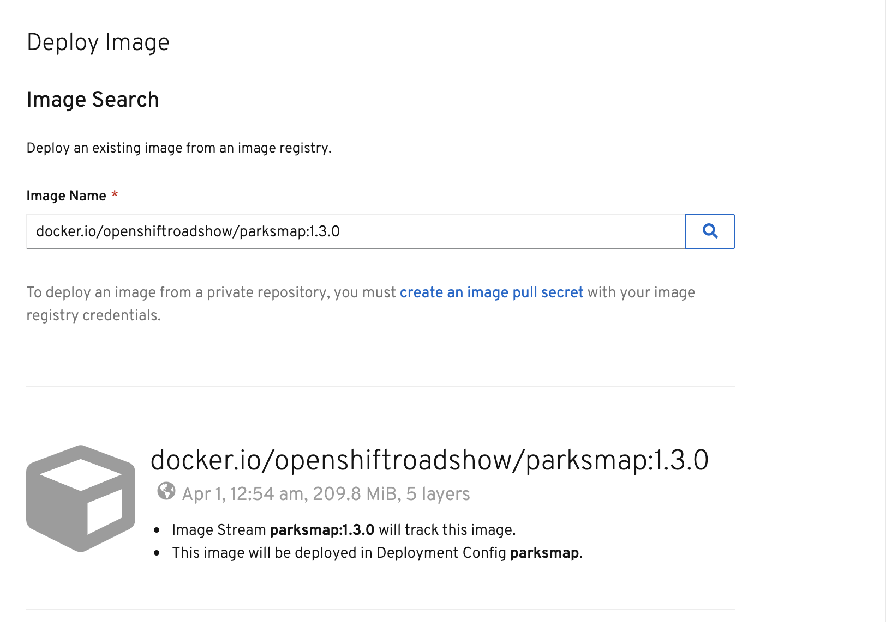
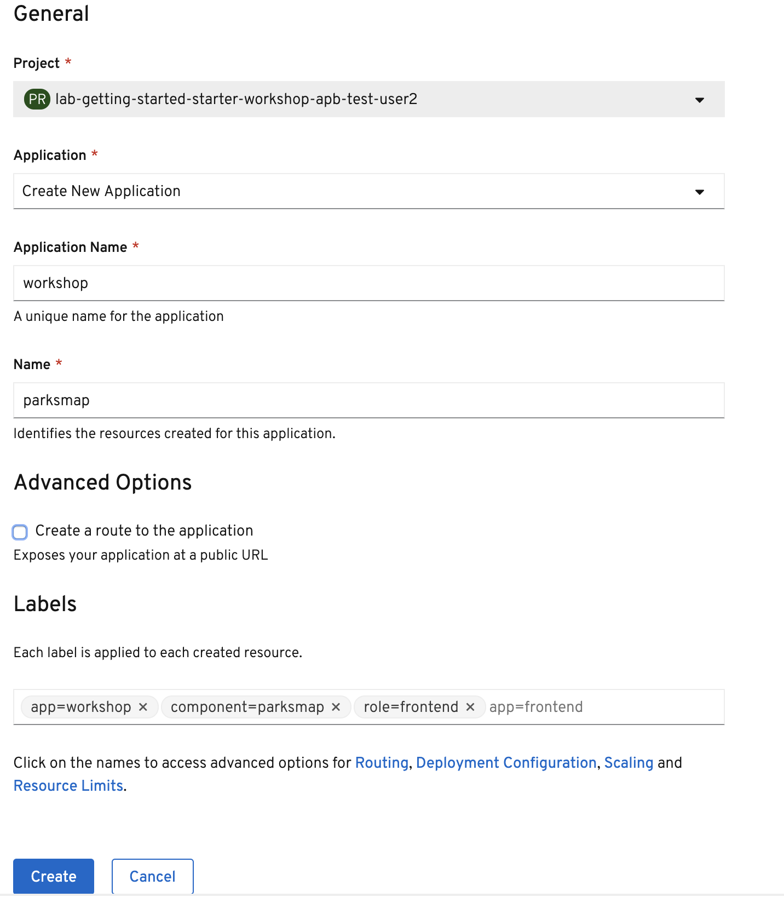
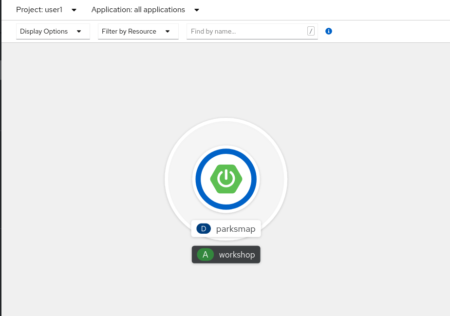
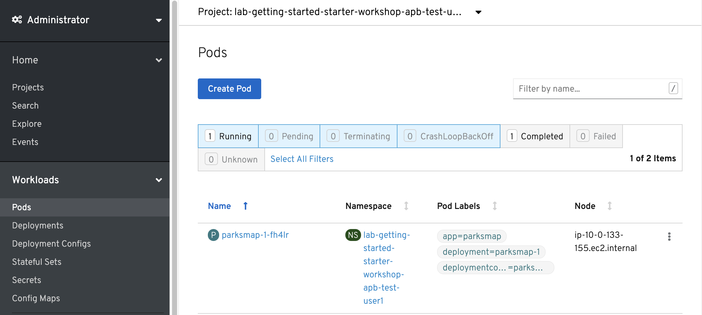
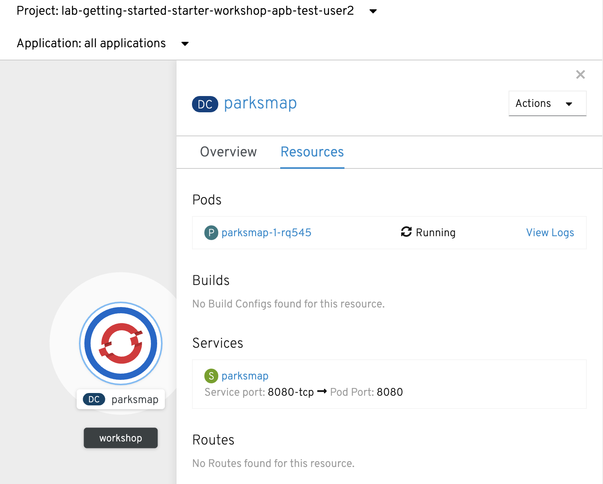
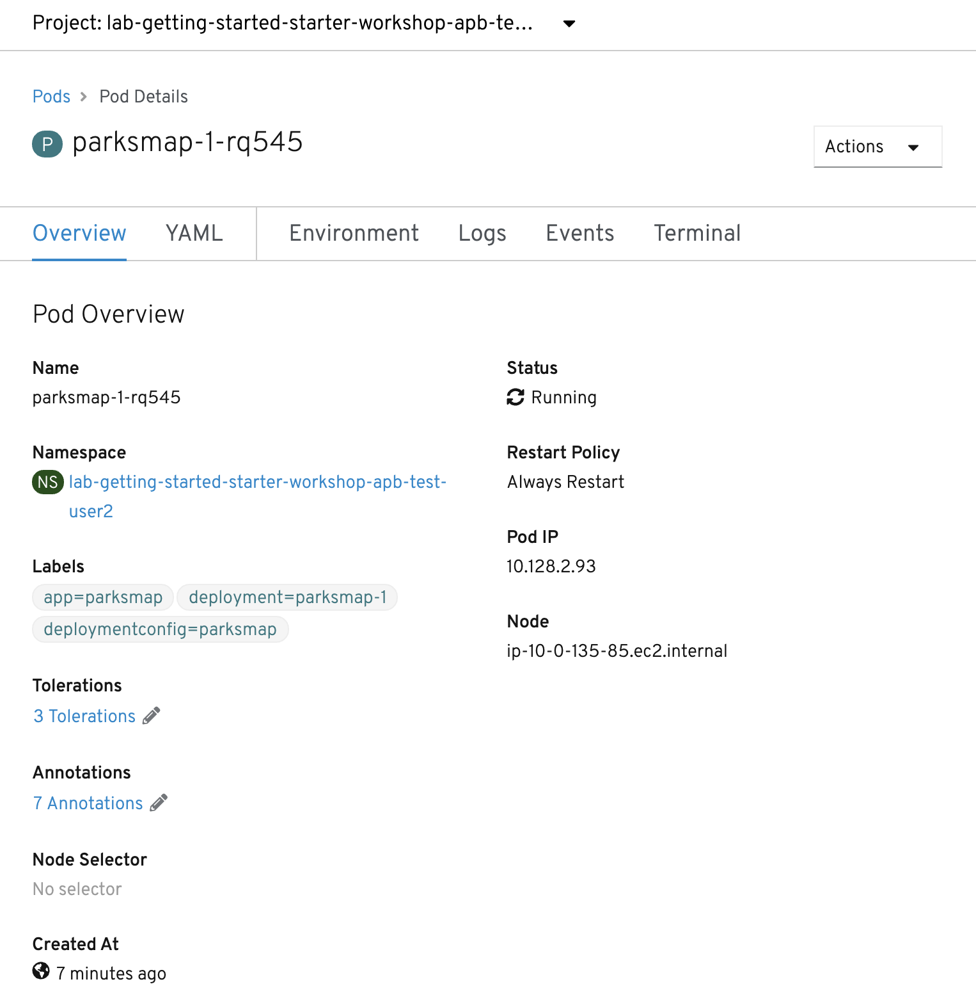
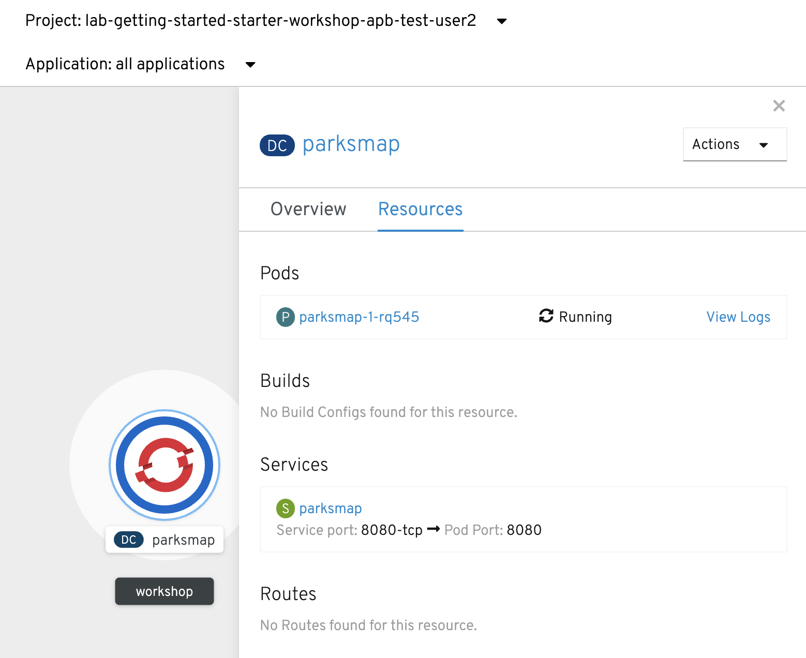
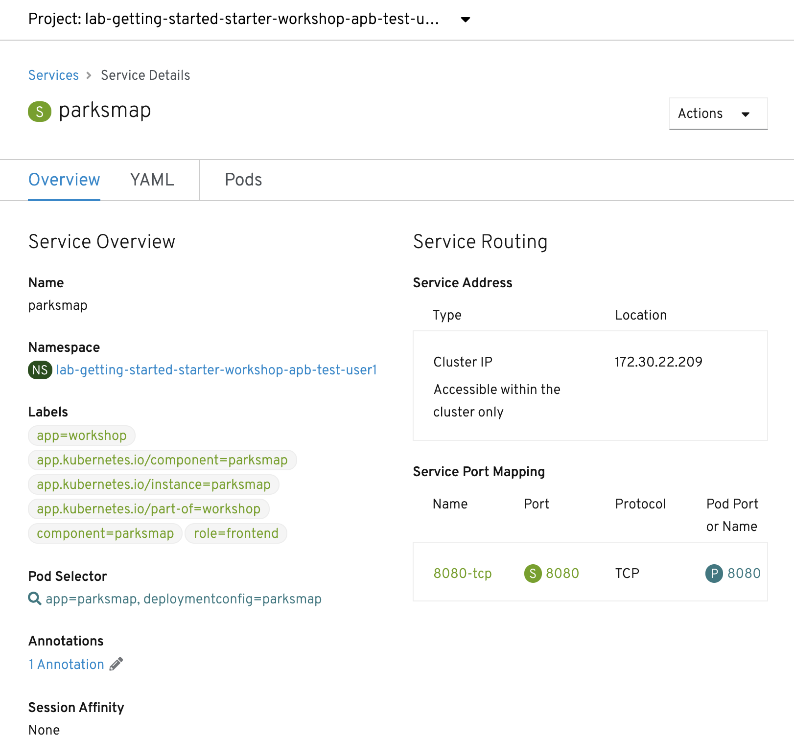

In this lab, we're going to deploy the web component of the ParksMap application which is also called `parksmap` and uses OpenShift's service discovery mechanism to discover the backend services deployed and shows their data on the map.

image::images/roadshow-app-architecture-parksmap-1.png[Application architecture,800,align="center"]

== Exercise: Deploying your First Image

Let's start by doing the simplest thing possible - get a plain old
Docker-formatted image to run on OpenShift. This is incredibly simple to do.
With OpenShift it can be done directly from the web console.

Return to the link:{{console_url}}/topology/ns/{{project_namespace}}[Web Console] ++++++.

If you're no longer on the *Topology* view in the Developer perspective, return there now. Click *Container Image* to open a dialog that will allow you to specify the information for the image you want to deploy.

In the *Image Name* field, copy/paste the following into the box:

[source,role=copy]
----
docker.io/openshiftroadshow/{{PARKSMAP_IMAGENAME}}:{{PARKSMAP_VERSION}}
----

Either press *enter* or click on the magnifying glass. OpenShift will then go
out to the container registry specified and interrogate the image.

Your screen will end up looking something like this:

Make sure to have the correct values in the *Application Name* and *Name* fields.

At the bottom of the page, click *Labels* in the Advanced Options section and add some labels to better identify this deployment later. Labels will help us identify and filter components in the web console and in the command line.

We will add 3 labels. After you enter the name=value pair for each label, press *enter* before typing the next. First the name to be given to the application.

[source,role=copy]
----
app=workshop
----

Next the name of this deployment.

[source,role=copy]
----
component=parksmap
----

And finally, the role this component plays in the overall application.

[source,role=copy]
----
role=frontend
----

Un-check the checkbox next to "Create a route to the application". For learning purposes, we will create a *Route* for the application later in the workshop.

Next, click the blue *Create* button. You will be directed to the *Topology* page, where you should see the visualization for the `parksmap` deployment config in the `workshop` application.

These few steps are the only ones you need to run to get a
container image deployed on OpenShift. This should work with any
container image that follows best practices, such as defining an EXPOSE
port, not needing to run specifically as the *root user* or other user name, and a single non-exiting CMD to execute on start.

NOTE: Providing appropriate labels is desired when deploying complex applications for organization purposes. OpenShift uses a label *app* to define and group components together in the Overview page. OpenShift will create this label with some default if the user doesn't provide it explicitly.

== Background: Containers and Pods

Before we start digging in, we need to understand how containers and *Pods* are
related. We will not be covering the background on these technologies in this lab but if you have questions please inform the instructor. Instead, we will dive right in and start using them.

In OpenShift, the smallest deployable unit is a *Pod*. A *Pod* is a group of one or more OCI containers deployed together and guaranteed to be on the same host.
From the official OpenShift documentation:

[quote]
__
Each *Pod* has its own IP address, therefore owning its entire port space, and
containers within pods can share storage. *Pods* can be "tagged" with one or
more labels, which are then used to select and manage groups of *pods* in a
single operation.
__

*Pods* can contain multiple OCI containers. The general idea is for a *Pod* to
contain a "main process" and any auxiliary services you want to run along with that process. Examples of containers you might put in a *Pod* are, an Apache HTTPD
server, a log analyzer, and a file service to help manage uploaded files.

== Exercise: Examining the Pod

If you click on the `parksmap` entry in the Topology view, you will see some information about that deployment config. The *Resources* tab may be displayed by default. If so, click on the *Overview* tab. On that panel, you will see that there is a single *Pod* that was created by your actions.

image::images/parksmap-overview.png[Pod overview]

You can also get a list of all the *Pods* created within your *Project*, by navigating to *Workloads -> Pods* in the Administrator perspective of the web console.

This *Pod* contains a single container, which
happens to be the `parksmap` application - a simple Spring Boot/Java application.

You can also examine *Pods* from the command line:

[source,bash,role=execute-1]
----
oc get pods
----

You should see output that looks similar to:

[source,text]
----
NAME                READY   STATUS      RESTARTS   AGE
parksmap-1-deploy   0/1     Completed   0          4m56s
parksmap-1-gxbgq    1/1     Running     0          4m48s
----

The above output lists all of the *Pods* in the current *Project*, including the
*Pod* name, state, restarts, and uptime. Once you have a *Pod*'s name, you can
get more information about the *Pod* using the `oc get` command.  To make the
output readable, I suggest changing the output type to *YAML* using the
following syntax:

NOTE: Make sure you use the correct *Pod* name from your output.

[source,bash,role=copy-and-edit]
----
oc get pod parksmap-1-gxbgq -o yaml
----

You should see something like the following output (which has been truncated due
to space considerations of this workshop manual):

[source,text]
----
apiVersion: v1
kind: Pod
metadata:
  annotations:
    k8s.v1.cni.cncf.io/networks-status: |-
      [{
          "name": "openshift-sdn",
          "interface": "eth0",
          "ips": [
              "10.130.2.68"
          ],
          "default": true,
          "dns": {}
      }]
    openshift.io/deployment-config.latest-version: "1"
    openshift.io/deployment-config.name: parksmap
    openshift.io/deployment.name: parksmap-1
    openshift.io/generated-by: OpenShiftWebConsole
    openshift.io/scc: restricted
  creationTimestamp: 2019-05-20T17:45:45Z
  generateName: parksmap-1-
  labels:
    app: parksmap
    deployment: parksmap-1
    deploymentconfig: parksmap
  name: parksmap-1-gxbgq
...............
----

The web interface also shows a lot of the same information on the *Pod* details
page. If you click on the name of the *Pod*, you will
find the details page. You can also get there by clicking on the `parksmap` deployment config on the *Topology* page, selecting *Resources*, and then clicking the *Pod* name.

Getting the `parksmap` image running may take a little while to complete. Each
OpenShift node that is asked to run the image has to pull (download) it, if the
node does not already have it cached locally. You can check on the status of the
image download and deployment in the *Pod* details page, or from the command
line with the `oc get pods` command that you used before.

== Background: Customizing the Image Lifecycle Behavior

Whenever OpenShift asks the node's CRI (Container Runtime Interface) runtime (Docker daemon or CRI-O) to run an image, the runtime will check to make sure it has the right "version" of the image to run.
If it doesn't, it will pull it from the specified registry.

There are a number of ways to customize this behavior. They are documented in
https://{{DOCS_URL}}/applications/application-life-cycle-management/creating-new-applications.html#applications-create-using-cli-image-creating-new-applications[specifying an image]
as well as
https://{{DOCS_URL}}/dev_guide/managing_images.html#image-pull-policy[image pull policy].

== Background: Services

*Services* provide a convenient abstraction layer inside OpenShift to find a
group of similar *Pods*. They also act as an internal proxy/load balancer between
those *Pods* and anything else that needs to access them from inside the
OpenShift environment. For example, if you needed more `parksmap` instances to
handle the load, you could spin up more *Pods*. OpenShift automatically maps
them as endpoints to the *Service*, and the incoming requests would not notice
anything different except that the *Service* was now doing a better job handling
the requests.

When you asked OpenShift to run the image, it automatically created a *Service*
for you. Remember that services are an internal construct. They are not
available to the "outside world", or anything that is outside the OpenShift
environment. That's okay, as you will learn later.

The way that a *Service* maps to a set of *Pods* is via a system of *Labels* and
*Selectors*. *Services* are assigned a fixed IP address and many ports and
protocols can be mapped.

There is a lot more information about
https://{{DOCS_URL}}/architecture/understanding-development.html#understanding-kubernetes-pods[Services],
including the YAML format to make one by hand, in the official documentation.

Now that we understand the basics of what a *Service* is, let's take a look at
the *Service* that was created for the image that we just deployed. In order to
view the *Services* defined in your *Project*, enter in the following command:

[source,bash,role=execute-1]
----
oc get services
----

You should see output similar to the following:

[source,bash]
----
NAME       TYPE        CLUSTER-IP      EXTERNAL-IP   PORT(S)    AGE
parksmap   ClusterIP   172.30.22.209  <none>        8080/TCP   3h
----

In the above output, we can see that we have a *Service* named `parksmap` with an
IP/Port combination of 172.30.22.209/8080TCP. Your IP address may be different, as
each *Service* receives a unique IP address upon creation. *Service* IPs are
fixed and never change for the life of the *Service*.

In the Developer perspective from the *Topology* view, service information is available by clicking the `parksmap` deployment config, then *Resources*, and then you should see the `parksmap` entry in the *Services* section.

You can also get more detailed information about a *Service* by using the
following command to display the data in YAML:

[source,bash,role=execute-1]
----
oc get service parksmap -o yaml
----

You should see output similar to the following:

[source,text]
----
apiVersion: v1
kind: Service
metadata:
  annotations:
    openshift.io/generated-by: OpenShiftWebConsole
  creationTimestamp: "2019-08-30T14:10:12Z"
  labels:
    app: workshop
    app.kubernetes.io/component: parksmap
    app.kubernetes.io/instance: parksmap
    app.kubernetes.io/part-of: workshop
    component: parksmap
    role: frontend
  name: parksmap
  namespace: lab-getting-started-starter-workshop-apb-test-user1
  resourceVersion: "1062269"
  selfLink: /api/v1/namespaces/lab-getting-started-starter-workshop-apb-test-user1/services/parksmap
  uid: e1ff69c8-cb2f-11e9-82a1-0267eec7e1a0
spec:
  clusterIP: 172.30.22.209
  ports:
  - name: 8080-tcp
    port: 8080
    protocol: TCP
    targetPort: 8080
  selector:
    app: parksmap
    deploymentconfig: parksmap
  sessionAffinity: None
  type: ClusterIP
status:
  loadBalancer: {}
----

Take note of the `selector` stanza. Remember it.

Alternatively, you can use the web console to view information about the *Service* by clicking on it from the previous screen.

It is also of interest to view the YAML of the *Pod* to understand how OpenShift
wires components together. For example, run the following command to get the
name of your `parksmap` *Pod*:

[source,bash,role=execute-1]
----
oc get pods
----

You should see output similar to the following:

[source,bash]
----
NAME                READY   STATUS      RESTARTS   AGE
parksmap-1-deploy   0/1     Completed   0          12m
parksmap-1-gxbgq    1/1     Running     0          12m
----

Now you can view the detailed data for your *Pod* with the following command:

[source,bash,role=copy-and-edit]
----
oc get pod parksmap-1-gxbgq -o yaml
----

Under the `metadata` section you should see the following:

[source,bash]
----
  labels:
    app: parksmap
    deployment: parksmap-1
    deploymentconfig: parksmap
----

* The *Service* has `selector` stanza that refers to `deploymentconfig=parksmap`.
* The *Pod* has multiple *Labels*:
** `app=parksmap`
** `deployment=parksmap-1`
** `deploymentconfig=parksmap`

*Labels* are just key/value pairs. Any *Pod* in this *Project* that has a *Label* that
matches the *Selector* will be associated with the *Service*. To see this in
action, issue the following command:

[source,bash,role=execute-1]
----
oc describe service parksmap
----

You should see something like the following output:

[source,text]
----
Name:              parksmap
Namespace:         lab-getting-started-starter-workshop-apb-test-user1
Labels:            app=workshop
                   app.kubernetes.io/component=parksmap
                   app.kubernetes.io/instance=parksmap
                   app.kubernetes.io/part-of=workshop
                   component=parksmap
                   role=frontend
Annotations:       openshift.io/generated-by: OpenShiftWebConsole
Selector:          app=parksmap,deploymentconfig=parksmap
Type:              ClusterIP
IP:                172.30.22.209
Port:              8080-tcp  8080/TCP
TargetPort:        8080/TCP
Endpoints:         10.128.2.90:8080
Session Affinity:  None
Events:            <none>
----

You may be wondering why only one endpoint is listed. That is because there is
only one *Pod* currently running.  In the next lab, we will learn how to scale
an application, at which point you will be able to see multiple endpoints
associated with the *Service*.
