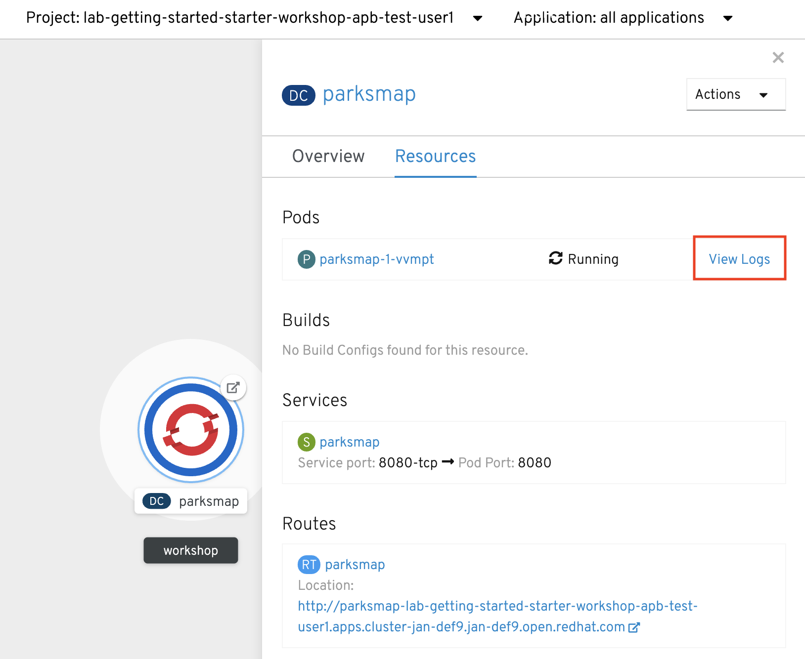
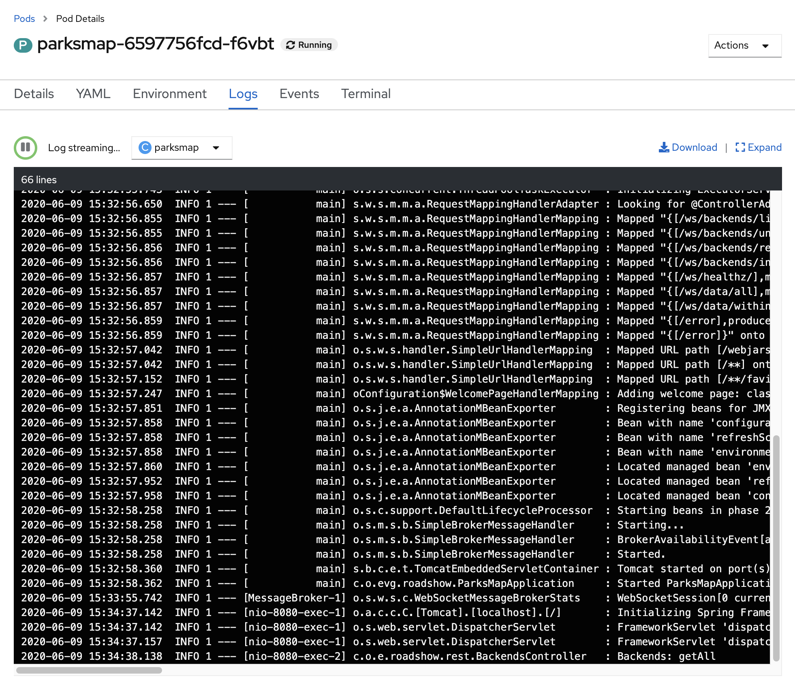
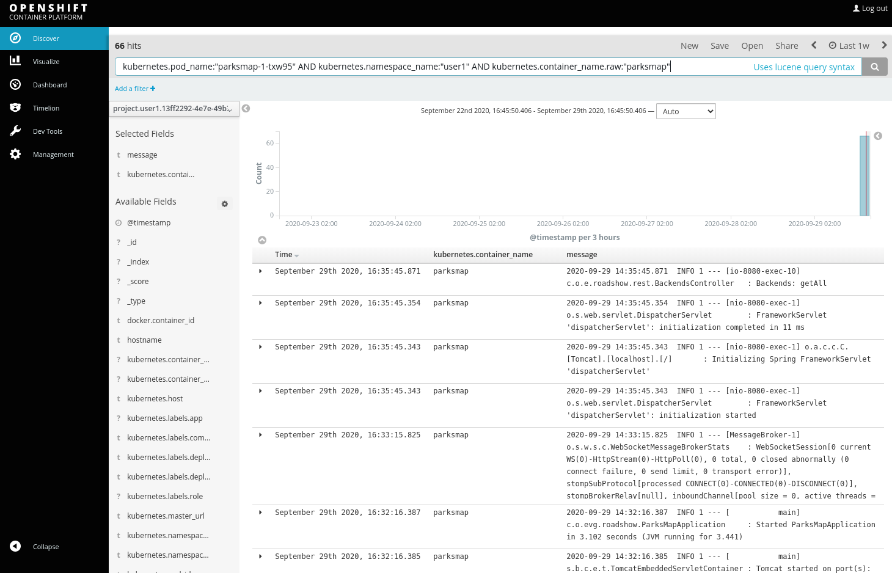
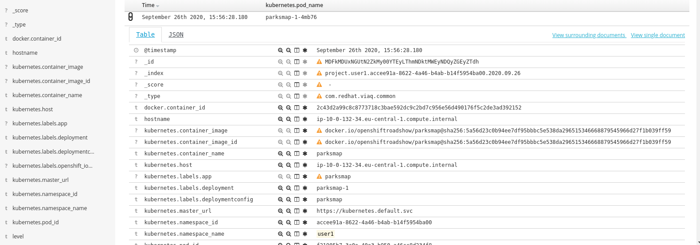

OpenShift provides some convenient mechanisms for viewing application logs.
First and foremost is the ability to examine a *Pod*'s logs directly from the
web console or via the command line.

== Background: Container Logs

OpenShift is constructed in such a way that it expects containers to log all
information to `STDOUT`. In this way, both regular and error information is
captured via standardized Docker mechanisms. When exploring the *Pod*'s logs
directly, you are essentially going through the Docker daemon to access the
container's logs, through OpenShift's API.

[NOTE]
====
In some cases, applications may not have been designed to send all of their
information to `STDOUT` and `STDERR`. In many cases, multiple local log files
are used. While OpenShift cannot parse any information from these files, nothing
prevents them from being created, either. In other cases, log information is
sent to some external system. Here, too, OpenShift does not prohibit these
behaviors. If you have an application that does not log to `STDOUT`, either because it
already sends log information to some "external" system or because it writes
various log information to various files, fear not.
====

== Exercise: Examining Logs

Since we already deployed our application, we can take some time to examine its
logs. In the Developer Console, from Topology view, click the `parksmap` entry and then the *Resources* tab. You should see a *View Logs* link next to the *Pod* entry.

Click the *View Logs* link and you should see a nice view of the *Pod*'s logs:

WARNING: If you notice some errors in the log, that's okay. We'll remedy those in a little bit.

You also have the option of viewing logs from the command line. Get the name of
your *Pod*:

[source,bash,role=execute-1]
----
oc get pods
----

[source,bash]
----
NAME               READY     STATUS    RESTARTS   AGE
parksmap-1-hx0kv   1/1       Running   0          5h
----

And then use the `logs` command to view this *Pod*'s logs:

[source,bash,role=copy-and-edit]
----
oc logs parksmap-1-hx0kv
----

You will see all of the application logs scroll on your screen:

[source,bash]
----
2019-05-22 19:37:01.433  INFO 1 --- [           main] o.s.m.s.b.SimpleBrokerMessageHandler     : Started.
2019-05-22 19:37:01.465  INFO 1 --- [           main] s.b.c.e.t.TomcatEmbeddedServletContainer : Tomcat started on port(s): 8080 (http)
2019-05-22 19:37:01.468  INFO 1 --- [           main] c.o.evg.roadshow.ParksMapApplication     : Started ParksMapApplication in 3.97 seconds (JVM running
 for 4.418)
2019-05-22 19:38:00.762  INFO 1 --- [MessageBroker-1] o.s.w.s.c.WebSocketMessageBrokerStats    : WebSocketSession[0 current WS(0)-HttpStream(0)-HttpPoll(
0), 0 total, 0 closed abnormally (0 connect failure, 0 send limit, 0 transport error)], stompSubProtocol[processed CONNECT(0)-CONNECTED(0)-DISCONNECT(0)]
, stompBrokerRelay[null], inboundChannel[pool size = 0, active threads = 0, queued tasks = 0, completed tasks = 0], outboundChannel[pool size = 0, active
 threads = 0, queued tasks = 0, completed tasks = 0], sockJsScheduler[pool size = 1, active threads = 1, queued tasks = 0, completed tasks = 0]
2019-05-22 19:44:11.517  INFO 1 --- [nio-8080-exec-1] o.a.c.c.C.[Tomcat].[localhost].[/]       : Initializing Spring FrameworkServlet 'dispatcherServlet'
2019-05-22 19:44:11.517  INFO 1 --- [nio-8080-exec-1] o.s.web.servlet.DispatcherServlet        : FrameworkServlet 'dispatcherServlet': initialization sta
rted
2019-05-22 19:44:11.533  INFO 1 --- [nio-8080-exec-1] o.s.web.servlet.DispatcherServlet        : FrameworkServlet 'dispatcherServlet': initialization com
pleted in 16 ms
2019-05-22 19:44:13.395  INFO 1 --- [nio-8080-exec-2] c.o.e.roadshow.rest.BackendsController   : Backends: getAll
----

WARNING: If you scroll through the logs, you may notice an error that mentions a service account. What's that?  Never fear, we will cover that shortly.

== Exercise: Aggregated Pod Logs

WARNING: This section is only relevant if the aggregated logging
capability is available in the OpenShift cluster, as this capability is optional.

When your application consists of only one *Pod* and it never fails, restarts,
or has other issues, these ways to view logs may not be so bad. However in a
scaled-out application where *Pods* may have restarted, been scaled up or down,
or if you just want to get historical information, these mechanisms may be
insufficient.

Fortunately, OpenShift provides an optional system for log aggregation that uses
Elasticsearch, Fluentd, and Kibana (EFK).

In the OpenShift web console, click *Monitoring -> Logging* from the left navigation. 

Clicking this link takes you to the Kibana web interface. This interface is
secured with OpenShift's role-based access controls, so you can only see logs
for projects that you have access to. You will need to accept the SSL certificate. If you are prompted to authenticate, use the same credentials as with OpenShift.

CAUTION: In the following Kibana search(es), replace `{{ USER_PROJECT }}` with the project provided to you and the pod_name to match your pod.

[source,bash,role=copypaste]
----
kubernetes.pod_name:"parksmap-1-mrxfq" AND kubernetes.namespace_name:"{{ USER_PROJECT }}"
----

[NOTE]
====
If your search returns no hits, try changing the time-picker in the top right-hand corner from the default "Last 15 miutes" to something else, like "The day so far" or "Last 1 hour"
====

If you want to see all the historical logs for this *Project*, simply remove the
pod name reference and click the magnifying glass or press the enter key.

CAUTION: In the following Kibana search(es), replace `{{ USER_PROJECT }}` with the project provided to you.

[source,bash,role=copypaste]
----
kubernetes.namespace_name:"{{ USER_PROJECT }}"
----

If you click the "x" in the column for the container name, and, in the left bar,
click "add" for `kubernetes.pod_name`, you'll then see your old *Pod*'s logs,
too. Remember, we scaled them down before coming here, so you can see how the
log system is keeping a historical record.

Try the following search string ensuring that you use the correct name for your project:

CAUTION: In the following Kibana search(es), replace `{{ USER_PROJECT }}` with the project provided to you.

[source,bash,role=copypaste]
----
kubernetes.namespace_name:"{{ USER_PROJECT }}" AND message:"Failure executing"
----
