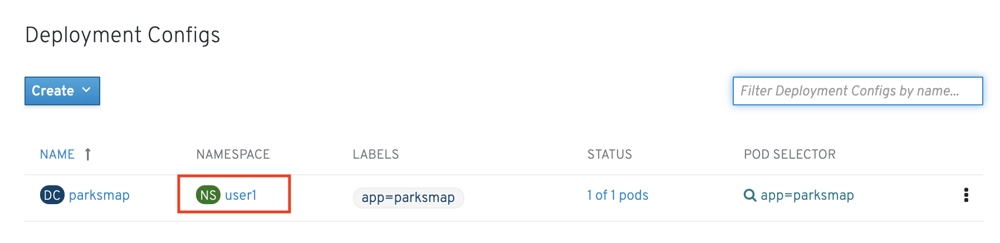
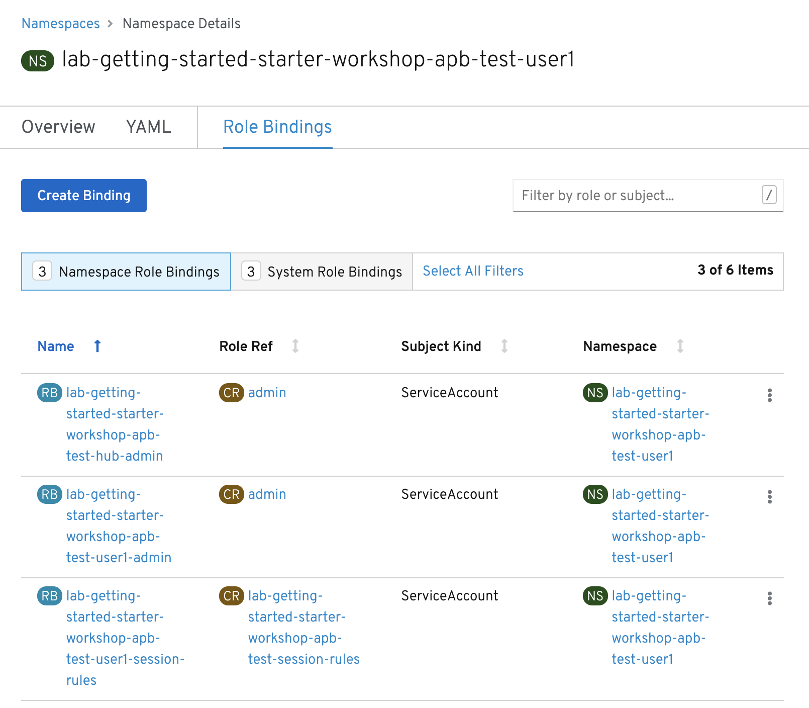
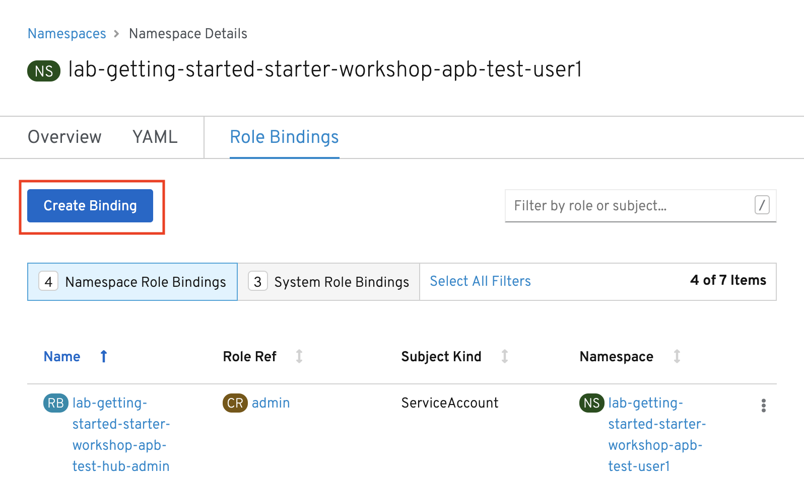
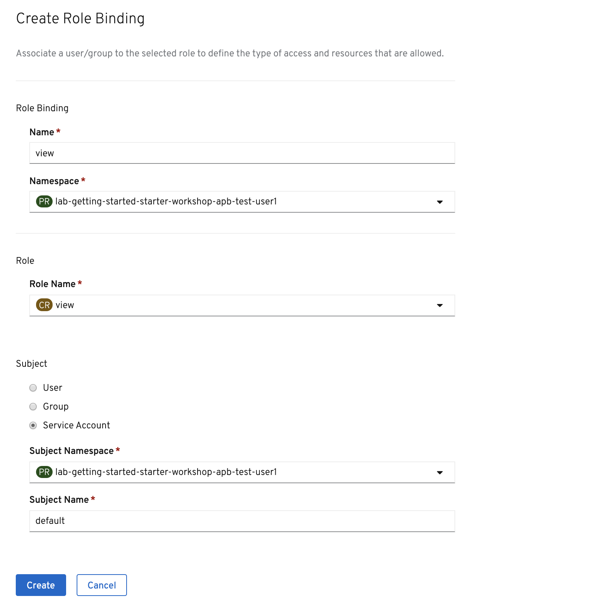
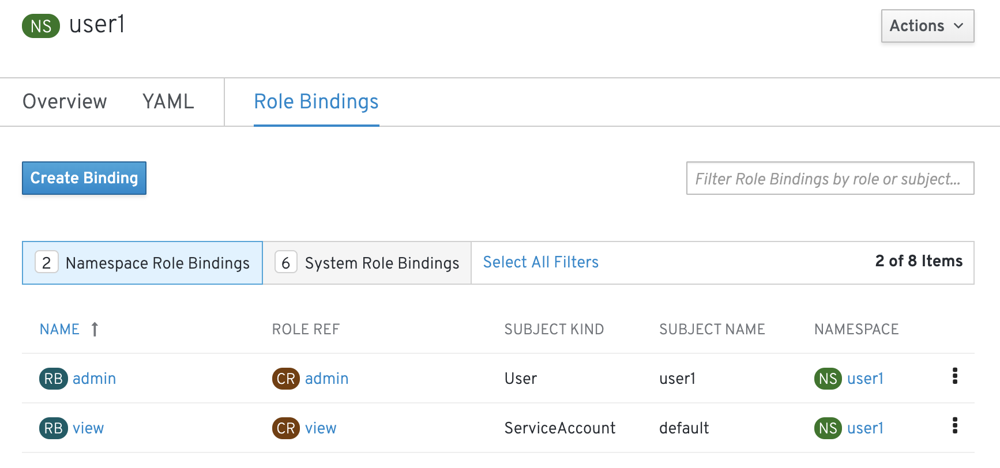
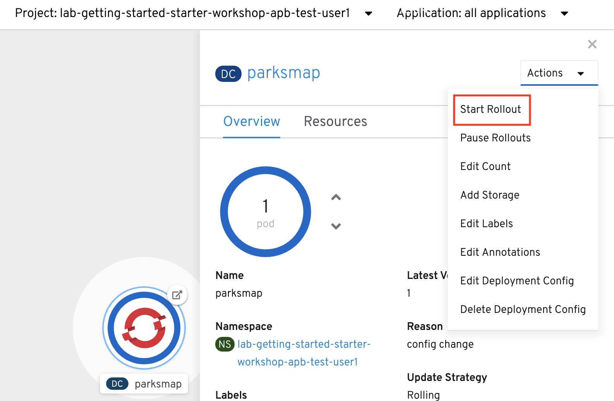
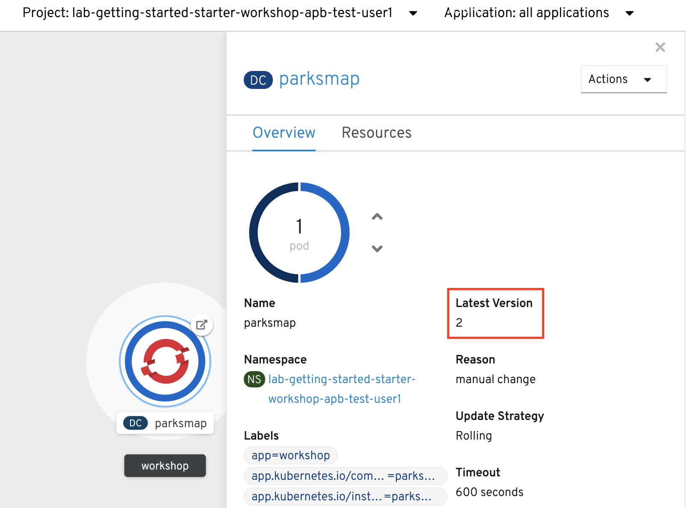

Almost every interaction with an OpenShift environment that you can think of
requires going through the OpenShift's control plane API. All API interactions are both authenticated (AuthN - who are you?) and authorized (AuthZ - are you allowed to do what you are asking?).

In the log aggregation lab we saw that there was an
error in reference to a *Service Account*.

As OpenShift is a declarative platform, some actions will be performed by the platform and not by the end user (when he or she issues a command). These actions are performed using a *Service Account* which is a special type of `user` that the platform will use internally.

OpenShift automatically creates a few special service accounts in every project.
The **default** service account is the one taking the responsibility of running the pods, and OpenShift uses and injects this service account into
every pod that is launched. By changing the permissions for that service
account, we can do interesting things.

You can view current permissions in the web console, go to the Topology view in the Developer Perspective, click the `parksmap` entry, and then click the *Namespace*. 

Then, click *Role Bindings*.

== Exercise: Grant Service Account View Permissions
The parksmap application wants to talk to the OpenShift API to learn about other
*Pods*, *Services*, and resources within the *Project*. You'll soon learn why!

[source,bash,role=execute-1]
----
oc project {{ project_namespace }}
----

Then:

[source,bash,role=execute-1]
----
oc policy add-role-to-user view -z default
----

The `oc policy` command above is giving a defined _role_ (`view`) to a user. But
we are using a special flag, `-z`. What does this flag do? From the `-h` output:

[source,bash]
----
-z, --serviceaccount=[]: service account in the current namespace to use as a user
----

The `-z` syntax is a special one that saves us from having to type out the
entire string, which, in this case, is
`system:serviceaccount:{{ project_namespace }}:default`. It's a nifty shortcut.

[NOTE]
====
The `-z` flag will only work for service accounts in the *current* project.
If you're referring to a service account in a different project, use the `-n <project>`switch.
====

Now that the `default` *Service Account* now has **view** access, so now it can query the API to see what resources are within the *Project*. This also has the added benefit of suppressing the error message! Although, in reality, we fixed the application.

Another way you could have done the same is by using the OpenShift console. Once you're on the 
*Workloads -> Deployment Configs* page, click on the *Namespace*, then *Role Bindings* and then the *Create Binding* button.

Select *view* for the Role Binding Name *{{ project_namespace }}* for the Namespace, *view* for the Role Name, *Service Account* for the Subject, *{{ project_namespace }}* for the Subject Namespace, and *default* for the Subject Name.

Once you're finished editing permissions, click on the *Create* button.

== Exercise: Redeploy Application
One more step is required. We need to re-deploy the `parksmap` application because it's
given up trying to query the API.

This time we'll use the web console. In the Developer Perspective, in Topology view, click the `parksmap` entry. Then, in the *Actions* dropdown menu, select *Start Rollout*.

A new deployment is immediately started. Return to Topology view and click the `parksmap` entry again to watch it happen. You might not be fast enough! But it will be reflected in the *Latest Version* number.

If you look at the logs for the application now, you should see no errors.  That's great.

== Exercise: Grant User View Permissions
If you create a project, you are that project's administrator. This means that
you can grant access to other users, too. If you like, give your neighbor view
access to your project using the following command:

CAUTION: In the following command(s), replace `{{ project_namespace  }}` with the user name of the person to whom you want to grant access.

[source,bash,role=copy-and-edit]
----
oc policy add-role-to-user view {{ project_namespace  }}
----

Have them go to the project view by clicking the *Projects* button and verify
that they can see your project and its resources. This type of arrangement (view
but not edit) might be ideal for a developer getting visibility into a
production application's project.
