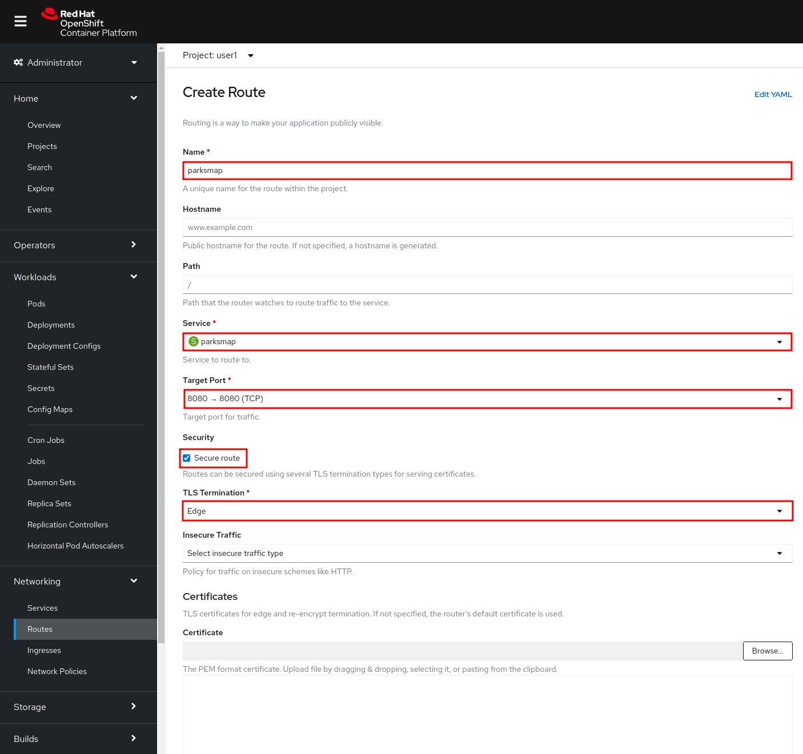
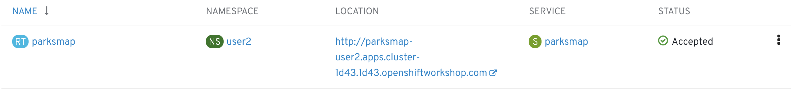
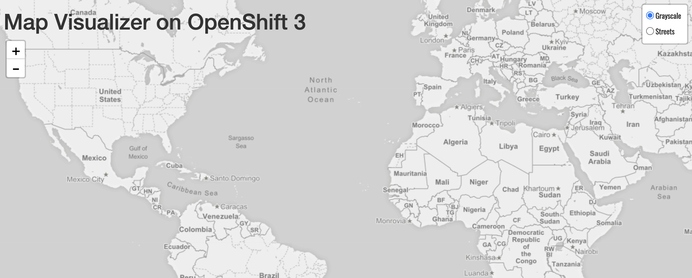

In this lab, we're going to make our application visible to the end users, so they can access it.

image::images/roadshow-app-architecture-parksmap-2.png[Application architecture,800,align="center"]

== Background: Routes

While *Services* provide internal abstraction and load balancing within an
OpenShift environment, sometimes clients (users, systems, devices, etc.)
**outside** of OpenShift need to access an application. The way that external
clients are able to access applications running in OpenShift is through the
OpenShift routing layer. And the data object behind that is a *Route*.

The default OpenShift router (HAProxy) uses the HTTP header of the incoming
request to determine where to proxy the connection. You can optionally define
security, such as TLS, for the *Route*. If you want your *Services*, and, by
extension, your *Pods*, to be accessible from the outside world, you need to
create a *Route*.

== Exercise: Creating a Route

You may remember that when we deployed the `parksmap` application, we un-checked the checkbox to 
create a *Route*. Normally it would have been created for us automatically. Fortunately, creating a *Route* is a pretty straight-forward process. You simply `expose` the *Service* via the command line. Or, via the *Administrator Perspective*, just click *Networking -> Routes* and then the *Create Route* button. 

Insert *parksmap* in *Name* field.

From *Service* field, select *parksmap*. For *Target Port*, select *8080*.

In *Security* section, check *Secure route*. Select *Edge* from *TLS Termination* list.

Leave all other fields blank and click *Create*:

image::images/parksmap-route-create-2.png[Create Route2,align="center"]

When creating a *Route*, some other options can be provided, like the hostname and path for the *Route* or the other TLS configurations.

When using the command line, we can first verify that we don't already have any existing *Routes*:

[source,bash,role=execute-1]
----
oc get routes
----

[source,bash]
----
No resources found.
----

Now we need to get the *Service* name to expose:

[source,bash,role=execute-1]
----
oc get services
----

[source,bash]
----
NAME       CLUSTER-IP       EXTERNAL-IP   PORT(S)    AGE
parksmap   172.30.169.213   <none>        8080/TCP   5h
----

Once we know the *Service* name, creating a *Route* is a simple one-command task:

[source,bash,role=execute-1]
----
oc create route edge parksmap --service=parksmap
----

[source,bash]
----
route.route.openshift.io/parksmap exposed
----

Verify the *Route* was created with the following command:

[source,bash,role=execute-1]
----
oc get route
----

[source,bash]
----
NAME       HOST/PORT                            PATH      SERVICES   PORT       TERMINATION   WILDCARD
parksmap   parksmap-{{project_namespace}}.{{cluster_subdomain}}             parksmap   8080-tcp   edge          None
----

You can also verify the *Route* in the *Developer Perspective* under the *Resources* tab for your `parksmap` deployment configuration. Also note that there is a decorator icon on the `parksmap` visualization now. If you click that, it will open the URL for your *Route* in a browser.

This application is now available at the URL shown in the Developer Perspective. Click the link and you will see it.

NOTE: At first time, the Browser will ask permission to get your position. This is needed by the Frontend app to center the world map to your location, if you don't allow it, it will just use a default location.

