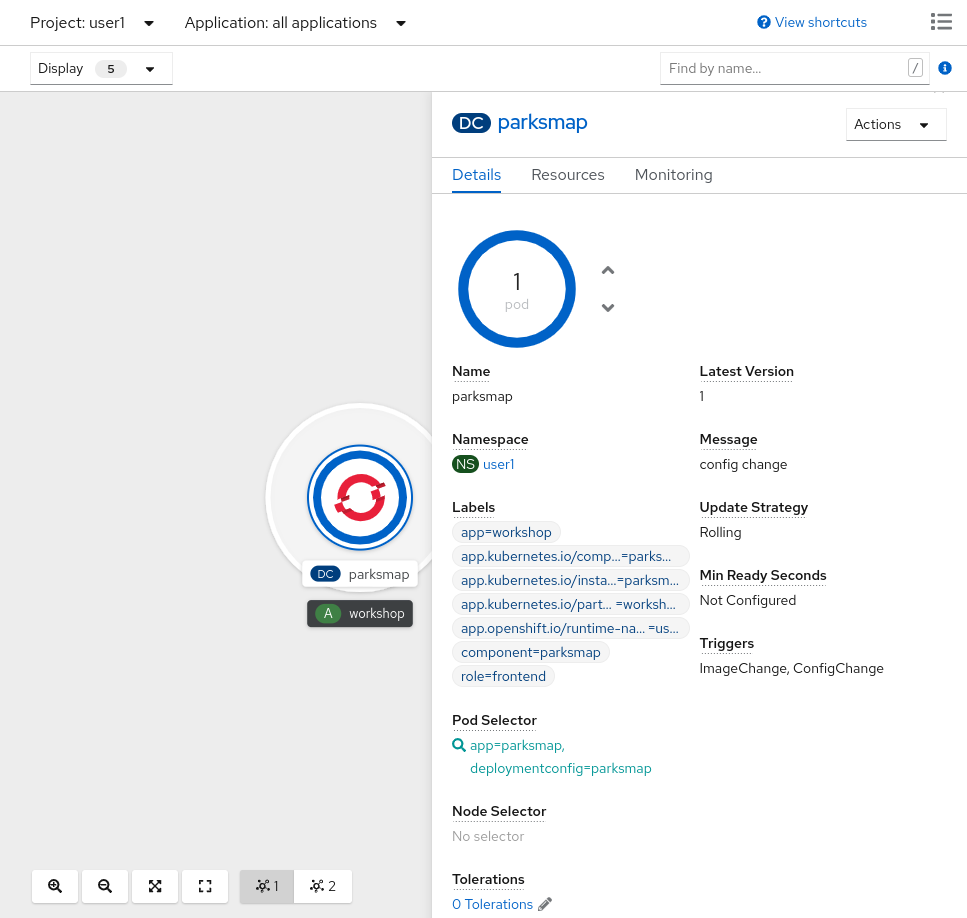
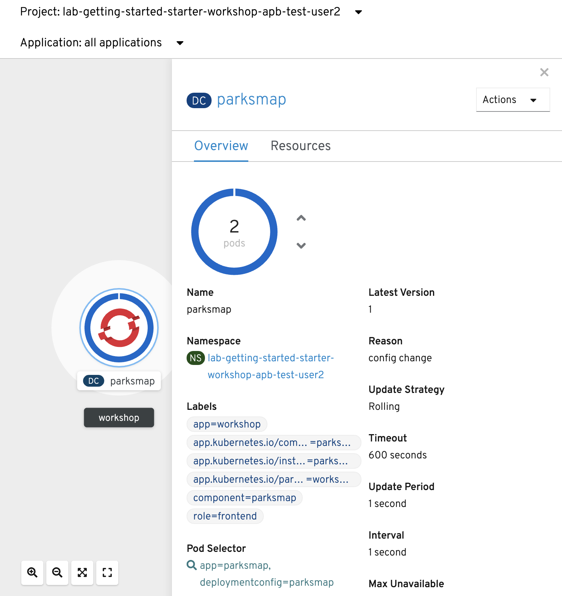

== Background: Deployments and ReplicaSets

While *Services* provide routing and load balancing for *Pods*, which may go in and
out of existence, *ReplicaSet* (RS) and *ReplicationController* (RC) are used to specify and then
ensure the desired number of *Pods* (replicas) are in existence. For example, if
you always want your application server to be scaled to 3 *Pods* (instances), a
*ReplicaSet* is needed. Without an RS, any *Pods* that are killed or
somehow die/exit are not automatically restarted. *ReplicaSets* and *ReplicationController* are how OpenShift "self heals" and while *Deployments* control *ReplicaSets*, *ReplicationController* here are controlled by *DeploymentConfigs*.

From the https://{{DOCS_URL}}/applications/deployments/what-deployments-are.html[deployments documentation]:

[quote]
__
Similar to a replication controller, a ReplicaSet is a native Kubernetes API object that ensures a specified number of pod replicas are running at any given time. The difference between a replica set and a replication controller is that a replica set supports set-based selector requirements whereas a replication controller only supports equality-based selector requirements.
__

In Kubernetes, a *Deployment* (D) defines how something should be deployed. In almost all cases, you will end up using the *Pod*, *Service*,
*ReplicaSet* and *Deployment* resources together. And, in
almost all of those cases, OpenShift will create all of them for you.

There are some edge cases where you might want some *Pods* and an *RS* without a *D*
or a *Service*, and others, so feel free to ask us about them after the labs.

== Exercise: Exploring Deployment-related Objects

Now that we know the background of what a *ReplicaSet* and
*Deployment* are, we can explore how they work and are related. Take a
look at the *Deployment* (D) that was created for you when you told
OpenShift to stand up the `parksmap` image:

[source,bash,role=execute-1]
----
oc get deployment
----

[source,bash]
----
NAME       READY   UP-TO-DATE   AVAILABLE   AGE
parksmap   1/1     1            1           20m
----

To get more details, we can look into the *ReplicaSet* (*RS*).

Take a look at the *ReplicaSet* (RS) that was created for you when
you told OpenShift to stand up the `parksmap` image:

[source,bash,role=execute-1]
----
oc get rs
----

[source,bash]
----
NAME                  DESIRED   CURRENT   READY   AGE
parksmap-65c4f8b676   1         1         1       21m
----

This lets us know that, right now, we expect one *Pod* to be deployed
(`Desired`), and we have one *Pod* actually deployed (`Current`). By changing
the desired number, we can tell OpenShift that we want more or less *Pods*.

OpenShift's *HorizontalPodAutoscaler* effectively monitors the CPU usage of a
set of instances and then manipulates the RCs accordingly.

You can learn more about the CPU-based
https://{{DOCS_URL}}/nodes/pods/nodes-pods-autoscaling.html#nodes-pods-autoscaling-about_nodes-pods-autoscaling[Horizontal Pod Autoscaler here]

== Exercise: Scaling the Application

Let's scale our parksmap "application" up to 2 instances. We can do this with
the `scale` command. You could also do this by incrementing the Desired Count in the OpenShift web console. Pick one of these methods; it's your choice.

[source,bash,role=execute-1]
----
oc scale --replicas=2 deployment/parksmap
----

You can also scale up to two pods in the *Developer Perspective*. From the Topology view, first click the `parksmap` deployment config and select the *Details* tab:

Next, click the *^* icon next to the Pod visualization to scale up to 2 pods.

image::images/parksmap-scaleup.png[Scaling up]

To verify that we changed the number of replicas, issue the following command:

[source,bash,role=execute-1]
----
oc get rs
----

[source,bash]
----
NAME                  DESIRED   CURRENT   READY   AGE
parksmap-65c4f8b676   2         2         2       23m
----

You can see that we now have 2 replicas. Let's verify the number of pods with
the `oc get pods` command:

[source,bash,role=execute-1]
----
oc get pods
----

[source,bash]
----
NAME                        READY   STATUS    RESTARTS   AGE
parksmap-65c4f8b676-fxcrq   1/1     Running   0          92s
parksmap-65c4f8b676-k5gkk   1/1     Running   0          24m
----

And lastly, let's verify that the *Service* that we learned about in the
previous lab accurately reflects two endpoints:

[source,bash,role=execute-1]
----
oc describe svc parksmap
----

You will see something like the following output:

[source,bash]
----
Name:              parksmap
Namespace:         user1
Labels:            app=workshop
                   app.kubernetes.io/component=parksmap
                   app.kubernetes.io/instance=parksmap
                   app.kubernetes.io/part-of=workshop
                   app.openshift.io/runtime-version=latest
                   component=parksmap
                   role=frontend
Annotations:       openshift.io/generated-by: OpenShiftWebConsole
Selector:          app=parksmap,deploymentconfig=parksmap
Type:              ClusterIP
IP:                172.30.136.210
Port:              8080-tcp  8080/TCP
TargetPort:        8080/TCP
Endpoints:         10.128.2.138:8080,10.131.0.93:8080
Session Affinity:  None
Events:            <none>
----

Another way to look at a *Service*'s endpoints is with the following:

[source,bash,role=execute-1]
----
oc get endpoints parksmap
----

And you will see something like the following:

[source,bash]
----
NAME       ENDPOINTS                           AGE
parksmap   10.128.2.90:8080,10.131.0.40:8080   45m
----

Your IP addresses will likely be different, as each pod receives a unique IP
within the OpenShift environment. The endpoint list is a quick way to see how
many pods are behind a service.

You can also see that both *Pods* are running in the Developer Perspective:

Overall, that's how simple it is to scale an application (*Pods* in a
*Service*). Application scaling can happen extremely quickly because OpenShift
is just launching new instances of an existing image, especially if that image
is already cached on the node.

== Application "Self Healing"

Because OpenShift's *RSs* are constantly monitoring to see that the desired number
of *Pods* actually are running, you might also expect that OpenShift will "fix" the
situation if it is ever not right. You would be correct!

Since we have two *Pods* running right now, let's see what happens if we
"accidentally" kill one. Run the `oc get pods` command again, and choose a *Pod*
name. Then, do the following:

[source,bash,role=copy-and-edit]
----
oc delete pod parksmap-65c4f8b676-k5gkk && oc get pods
----

[source,bash]
----
pod "parksmap-65c4f8b676-k5gkk" deleted
NAME                        READY   STATUS    RESTARTS   AGE
parksmap-65c4f8b676-bjz5g   1/1     Running   0          13s
parksmap-65c4f8b676-fxcrq   1/1     Running   0          4m48s
----

Did you notice anything? One container has been deleted, and there's a new container already being created. 

Also, the names of the *Pods* are slightly changed.
That's because OpenShift almost immediately detected that the current state (1
*Pod*) didn't match the desired state (2 *Pods*), and it fixed it by scheduling
another *Pod*.

Additionally, OpenShift provides rudimentary capabilities around checking the
liveness and/or readiness of application instances. If the basic checks are
insufficient, OpenShift also allows you to run a command inside the container in
order to perform the check. That command could be a complicated script that uses
any installed language.

Based on these health checks, if OpenShift decided that our `parksmap`
application instance wasn't alive, it would kill the instance and then restart
it, always ensuring that the desired number of replicas was in place.

More information on probing applications is available in the
https://{{DOCS_URL}}/applications/application-health.html[Application
Health] section of the documentation and later in this guide.

== Exercise: Scale Down

Before we continue, go ahead and scale your application down to a single
instance. Feel free to do this using whatever method you like.

WARNING: Don't forget to scale down back to 1 instance your `parksmap` component as otherwise you might experience some weird behavior in later labs. This is due to how the application has been coded and not to OpenShift itself.
